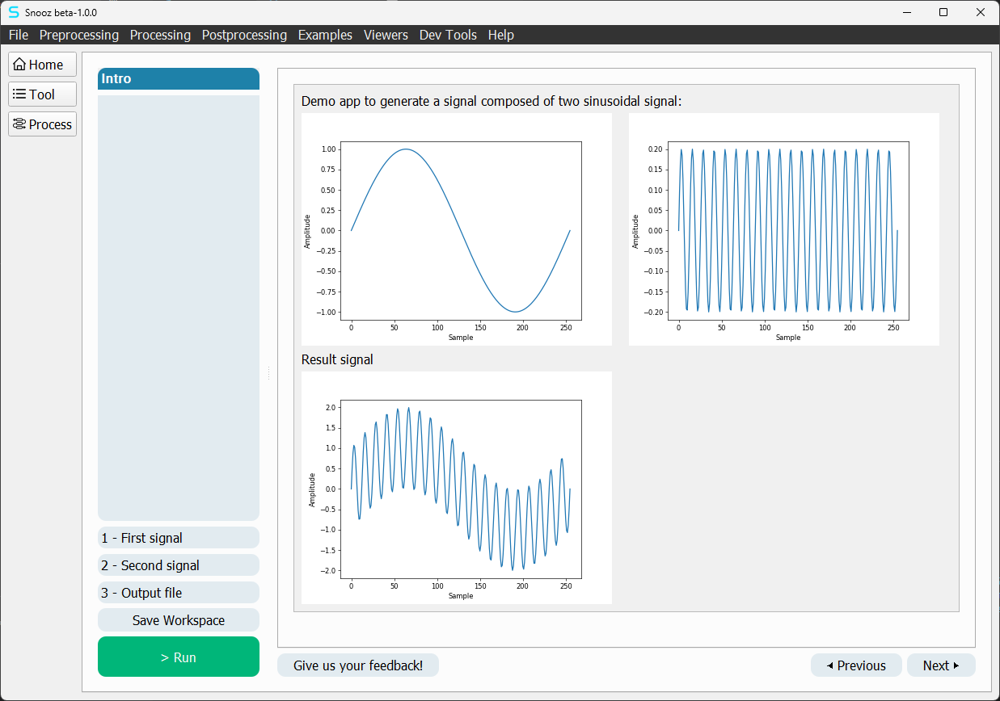
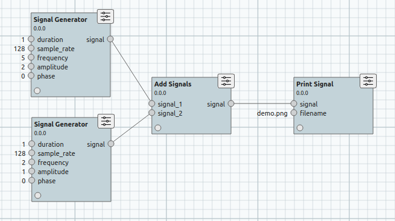
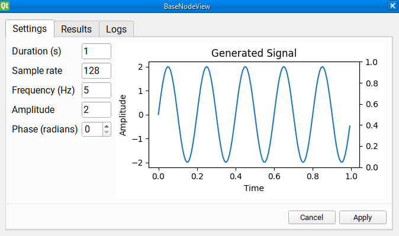
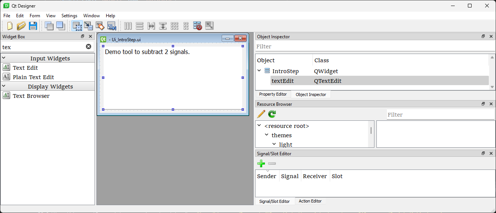

.. _explore_ex:

=======================================
Explore examples
=======================================

In order to explore the examples provided for developers, you must be able to run Snooz from the source code, 
and your own repository forked from ``snooz_package_template`` must be added to your VS Code workspace, see :ref:`run_snooz`.

Make sure the example packages for tools (``ExampleToolsPackage``) and modules (``ExampleModulesPackage``) are added and activated in Snooz. 
See :ref:`manage_package` for more details.

Once your environment is properly configured, you should find a new tool under the **Examples** menu in Snooz called **Signal Generator**.

Explore the Signal Generator tool
==========================================

The Signal Generator tool is a demo tool used to create a signal and export a preview as a PNG file. 
The user can configure two different signals, which can then be combined to create the resulting signal.

To launch the Signal Generator tool :

   - Launch Snooz (F5) from VS Code
   - In Snooz, navigate to **Examples -> Signal Generator**.

Once the tool is opened, you can explore its steps.  The tool consists of four configuration steps: 

1. **Intro step** explains what the tool is.
2. **First signal** is a parameters step to configure the first signal.
3. **Second signal** is a parameters step to configure the second signal.
4. **Output step**  is a parameters step to set the output filename.

This step-by-step interface is the UI format of all tools in Snooz.
Each tool defines a series of configuration steps, and once the user is satisfied with the settings, they can press the **Run** button to execute the tool's process.

.. note::
   To learn more about navigating the graphical interface of Snooz, see :ref:`tools`. You will also find a list of tools installed with Snooz.

Process
==============
A tool is a user-friendly abstraction layer that sits above a process. 
When the user presses Run in the step-by-step interface, it is the process that gets executed. 

Explore a process
--------------------------------------
To view the process behind a tool, simply press the **Process** button in the vertical navigation bar on the left (the third one).

As you can see in the Signal Generator tool, the process consists of two SignalGenerator modules, an AddSignal module, and a PrintSignal module. 
As mentioned above, this process doesn't require the step-by-step interface to function. 
The step-by-step interface is simply a user-friendly way to configure each module.

Create a process
--------------------------------------

Let's explore how to create a process using the same modules as the Signal Generator tool.

- In Snooz, navigate to **Dev Tools -> New process**.

.. warning::
   If you don't see the Examples category in the Module Library, click on the **Options** button and check the packages ExampleModulesPackage 0.0.0 and ExampleToolsPackage 0.0.0.

- Drag and drop the modules from the **Examples** category to reproduce the same process as the Signal Generator tool shown above.
- Connect the outputs with the inputs by clicking on the circle and dragging the link to the input.

Configure a process
--------------------------------------

Configuring a process involves setting up each module instantiated within the process.
To configure an instantiated module, double-click on it. 

This will open a dialog with three tabs: 

- **Settings** : Contains text fields for specific inputs.
- **Results** : Displays information about the last run of the module.
- **Logs**: Shows any logs associated with the module, which is especially useful if the module's settings cause the run to crash.

.. note::
   Settings page
      Note that the settings page you see when double-clicking on the SignalGenerator module is the exact same interface as the second and third steps of the Signal Generator step-by-step tool. In fact, it is the exact same code. 
      You can reuse any Settings page as a step for a tool. 
      This saves a lot of development time as you only need to do it once, and you can then use the interface in any step-by-step tool that uses that module. 
      We'll go into more detail on how to do that in a later section.

Save, open and run a process
--------------------------------------

Once the process is configured to your liking, your new process is now ready to be saved. 

To save the process : 

- In Snooz, navigate to **Dev Tools -> Save process as** or **Dev Tools -> Save process**.

The process is saved in a .json file, which can be opened in Snooz.

To open a process :

- In Snooz, navigate to **Dev Tools -> Open Process**.

You can also open it by navigating to **File -> Open Workspace**.

To run a process properly configured :

- In Snooz, navigate to **Dev Tools -> Run**.

Modules
==========================================

Modules are at the core of Snooz. All computations are done within a module's **compute(...)** function. 
This function receives input as parameters and must return an object for the output.

Debug a Module
--------------------

To debug a module, simply add a breakpoint in its compute function and run a process with your module included. 
When the execution of the process reaches your module, it will call the compute function, allowing you to step through it using the VS Code Debugger tool.

- In VS Code, navigate to the compute function of the GenerateSignal module (e.g. my_snooz_repo/modules/ExampleModulesPackage/GenerateSignal/GenerateSignal.py).
- Add a breakpoint to the compute function by clicking in the left margin of the file.
- Press F5 to launch Snooz.
- Open the Signal Generator tool.
- Configure the tool.
- Press Run in the tool UI (or press Ctrl-R) to execute it.

.. Note::
   You don't need to use a tool to debug a module. 
      You can also create a new process and add only your module to it. As long as the input values are valid, you'll be able to debug your module.

Create a Module
--------------------

In this section, we will create a new module as an example to subtract one signal from another and output the resulting signal.
The procedure will be the same for any other modules you may want to create. 

Let's first define the module's attributes:

 | **Name**: SubtractSignals
 | **Label**: Subtract Signals
 | **Category**: Examples
 | **Input1**: main_signal
 | **Input2**: signal_to_substract
 | **Output1**: signal

We use a command line tool to help create new modules. This makes the process much easier than writing all the necessary files from scratch.
To have access to the terminal in VS Code make sure to close Snooz. 

- In VS Code navigate to **Terminal -> New Terminal**
- Select your repository you forked from snooz_package_template (e.g. my_snooz_repo)
- Make sure the virtual environment **snooz_310_env** is activated (see :ref:`installation`)
- In the terminal type : ``python main_utils.py``
- Select **2- Create a module**
- Fill the rest with the information from above. If you make any mistakes, just repeat the steps and it will ask to overwrite the previous one.

As the message in the console mentions, there's a final step before you can use the module in a process. 
You need to generate the python files associated with the two .ui files of the module. 

In VS Code:

1. Find the new subfolder of your module called **SubstractSignals**
2. Right-click on file **Ui_SubstractSignalsResultsView.ui**
3. Select **Compile Qt UI file**.
4. Repeat the process for the file **Ui_SubstractSignalsSettingsView.ui**

Here the list of the files generated for the new module **SubstractSignals** :

.. list-table:: 
   :widths: 5 25 150
   :header-rows: 1

   * - Index
     - Filename
     - Description
   * - 1
     - __init__.py
     - File to indicate that the directory should be treated as a Python package.
   * - 2
     - SubstractSignals.json
     - | The attributes of the module in JSON format. 
       | This is used by Snooz to understand how to use this module in a process. 
       | If at some point you need to change your inputs or outputs, you'll need to modify this file.
   * - 3 
     - SubstractSignals.py
     - | This is where the actual work of the module takes place. 
       | The compute function will be called when the module needs to be executed in a process. 
       | The parameters of the compute function are the input values of the module and the return object is the output.
   * - 4 
     - SubstractSignalsSettingsView.py
     - | The class implementation of the "settings" tab when you double click on a module in Snooz. 
       | Used to manually set the input values of the module.
   * - 5 
     - SubstractSignalsResultsView.py
     - | The class implementation of the "result" tab when you double click on a module in Snooz. 
       | Used to show any kind of data resulting from the compute function of the module. 
       | It's often used to debug a process to see how the module behaved.
   * - 6 
     - Ui_SubstractSignalsSettingsView.ui
     - | .ui files are XML descriptions of a UI. This file is used by Qt Designer, 
       | a WYSIWYG tool for creating user interfaces in Qt. You won't modify this file directly, 
       | only through Qt Designer. This is the one for the "Settings" tab.
   * - 7 
     - Ui_SubstractSignalsResultsView.ui
     - | .ui files are XML descriptions of a UI. This file is used by Qt Designer, 
       | a WYSIWYG tool for creating user interfaces in Qt. You won't modify this file directly, 
       | only through Qt Designer. This is the one for the "Results" tab.
   * - 8
     - Ui_SubstractSignalsSettingsView.py
     - | The Python file generated from the .ui file of the same name. 
       | This file is generated by the steps described previously and must be regenerated 
       | every time there is a change to the associated .ui file.
   * - 9
     - Ui_SubstractSignalsResultsView.py
     - | The Python file generated from the .ui file of the same name. 
       | This file is generated by the steps described previously and 
       | must be regenerated every time there is a change to the associated .ui file.

.. Note::

   Note that the tool generates a default Settings page to configure your module. 
   In this case, it's not very useful as the input must be linked to the output of a GeneratorSignal module. 
   But in other cases, it's often useful to have a basic settings page ready to go.

Write the SubstractSignals.py file
----------------------------------------

**Compute function**

Open the SubstractSignals.py file and change the compute() function for the following code:

.. code-block:: python

   def compute(self, main_signal,signal_to_substract):
      # Make appropriate checks to input values
      if not isinstance(main_signal, dict):
            raise NodeInputException(self.identifier, "main_signal", "main_signal must be a dictionary")
      if not isinstance(signal_to_substract, dict):
            raise NodeInputException(self.identifier, "signal_to_substract", "signal_to_substract must be a dictionary")
      
      if 'samples' not in main_signal or 'samples' not in signal_to_substract:
            raise NodeInputException(self.identifier, "samples", "main_signal and signal_to_substract must contain 'samples' key")

      if 'sample_rate' not in main_signal or 'sample_rate' not in signal_to_substract:
            raise NodeInputException(self.identifier, "sample_rate", "main_signal and signal_to_substract must contain 'sample_rate' key")
      
      if main_signal['sample_rate'] != signal_to_substract['sample_rate']:
            raise NodeInputException(self.identifier, "sample_rate", "Sample rates of both signals must be the same.")

      # Determine the lengths of the signal samples
      len_main_signal = len(main_signal['samples'])
      len_signal_to_substract = len(signal_to_substract['samples'])

      # Extend the shorter signal with zeros
      if len_main_signal < len_signal_to_substract:
            main_signal['samples'] = np.pad(main_signal['samples'], (0, len_signal_to_substract - len_main_signal), 'constant')
      elif len_signal_to_substract < len_main_signal:
            signal_to_substract['samples'] = np.pad(signal_to_substract['samples'], (0, len_main_signal - len_signal_to_substract), 'constant')

      # Perform the addition of the signals
      result_samples = main_signal['samples'] - signal_to_substract['samples']

      # Create the output signal dictionary
      output_signal = {
            'samples': result_samples,
            "sample_rate":main_signal['sample_rate']
      }

      return {'signal': output_signal}

.. Note::
   NodeInputException 
      The NodeInputException exception is used when there is a problem with the input of a module. 
      If it happens, Snooz will stop immediately and inform the user that a problem has occurred in the process. 
      You'll be able to see a trace of the log in the Logs tab of the module.

**Import the needed libraries**

Add ``import numpy as np`` at the beginning of the SubstractSignals.py file since numpy is used to pad the signal.
   
Test your module
----------------------------------------

Follow these steps to test your new module:

- In VS Code, launch Snooz (press F5)
- In Snooz, activate your new module (**File -> Settings -> Packages** and check SubtractSignals)
- Create a new process (navigate to **Dev Tools -> New process**)
- Drag and drop 2 SignalGenerator module
- Drag and drop your new SubstractSignals module
- Add a PrintSignal module
- Interconnect the modules (same as the Signal Generator tool)
- Configure each modules to your liking
- Save the new process **Dev Tools -> Save process as** and name the file ``SignalGeneratorV2_process.json``
- Select **Dev Tools -> Run** (or Ctrl-r) to execute it

Tools
==========================================

Create a new tool
-----------------------------------------

We use a command line tool to help create new tools. This makes the process much easier than writing all the necessary files from scratch.
To have access to the terminal in VS Code make sure to close Snooz. 

- In VS Code navigate to **Terminal -> New Terminal**
- Select your repository you forked from snooz_package_template (e.g. my_snooz_repo)
- Make sure the virtual environment **snooz_310_env** is activated (see :ref:`installation`)
- In the terminal type : ``python main_utils.py``
- Select **3- Create a tool**
- Answer the script questions with the attributes below

The tool's attribute to create :
 | **Package name** : ExampleToolsPackage
 | **Name**: SignalGeneratorV2
 | **Label**: Signal Generator version 2
 | **Category**: Examples
 | **Author**: Your name (or lab name) e.g. CEAMS
 | **Description**: Tool for generating a signal image.
 | **URL**: You can let it empty unless you have an URL to provide.

You will find a folder named **SignalGeneratorV2** under the **ExampleToolsPackage** folder.  
It contains a single json file ``SignalGeneratorV2.json`` that describes the tool.  

Add the process to your tool
-------------------------------

Add manually the process you created previously to this new tool.  

- Open the ``SignalGeneratorV2_process.json`` file you saved previously for your process.
- Copy the content of the field "process_params" into the ``SignalGeneratorV2.json`` file.
- Copy the content of the field "dependencies" into the ``SignalGeneratorV2.json`` file.
- The file will look as this one below:

.. code-block:: JSON

   {
      "item_name": "SignalGeneratorV2",
      "item_type": "tool",
      "item_api_version": "1.0.0",
      "tool_params": {
         "tool_label": "Signal Generator version 2",
         "tool_category": "Examples",
         "tool_author": "CEAMS",
         "tool_url": "",
         "tool_description": "Tool for generating a signal image.",
         "tool_version": "0.0.0",
         "package_name": "ExampleToolsPackage",
         "steps": []
      },
      "dependencies": [
         {
               "package_name": "ExampleToolsPackage",
               "package_version": "0.0.0",
               "deleteable": false
         },
         {
               "package_name": "ExampleModulesPackage",
               "package_version": "0.0.0"
         }
      ],
    "process_params": {
        "process_label": "",
        "nodes": [
            {
                "cls": "PrintSignal",
                "name": "PrintSignal",
                "metadata": {},
                "file_location": "",
                "module_label": "Print Signal",
                "module_category": "Examples",
                "module_options": {},
                "inputs": {
                    "signal": {
                        "name": "signal",
                        "value": "",
                        "sub_plugs": {},
                        "connections": {
                            "2082bbb9-58c1-4eb4-a9a0-12d74dd9805d": "signal"
                        }
                    },
                    "filename": {
                        "name": "filename",
                        "value": "C:/Users/demo_subtract.png",
                        "sub_plugs": {},
                        "connections": {}
                    }
                },
                "outputs": {},
                "module": "ExampleModulesPackage.PrintSignal",
                "identifier": "1756ce2a-fdc5-45cc-a44d-24e2563e7416",
                "activation_state": "activated",
                "package": {
                    "package_name": "ExampleModulesPackage"
                },
                "pos_x": 254.0,
                "pos_y": -41.0
            },
            {
                "cls": "SubtractSignals",
                "name": "SubtractSignals",
                "metadata": {},
                "file_location": null,
                "module": "ExampleModulesPackage.SubtractSignals",
                "module_label": "Subtract Signals",
                "module_category": "Examples",
                "module_author": "",
                "module_url": "",
                "module_description": "",
                "module_options": {},
                "inputs": {
                    "main_signal": {
                        "name": "main_signal",
                        "value": "",
                        "sub_plugs": {},
                        "connections": {
                            "d2917b17-f002-4257-acfc-b657c43e719a": "signal"
                        }
                    },
                    "signal_to_substract": {
                        "name": "signal_to_substract",
                        "value": "",
                        "sub_plugs": {},
                        "connections": {
                            "139c8af7-a905-40f0-9252-bc9b30971d05": "signal"
                        }
                    }
                },
                "outputs": {
                    "signal": {
                        "name": "signal",
                        "value": "",
                        "sub_plugs": {},
                        "connections": {
                            "1756ce2a-fdc5-45cc-a44d-24e2563e7416": [
                                "signal"
                            ]
                        }
                    }
                },
                "identifier": "2082bbb9-58c1-4eb4-a9a0-12d74dd9805d",
                "activation_state": "activated",
                "package": {
                    "package_name": "ExampleModulesPackage"
                },
                "pos_x": -15.0,
                "pos_y": -60.0
            },
            {
                "cls": "SignalGenerator",
                "name": "SignalGenerator",
                "metadata": {},
                "file_location": "",
                "module_label": "Signal Generator",
                "module_category": "Examples",
                "module_options": {},
                "inputs": {
                    "duration": {
                        "name": "duration",
                        "value": "1",
                        "sub_plugs": {},
                        "connections": {}
                    },
                    "sample_rate": {
                        "name": "sample_rate",
                        "value": "100",
                        "sub_plugs": {},
                        "connections": {}
                    },
                    "frequency": {
                        "name": "frequency",
                        "value": "10",
                        "sub_plugs": {},
                        "connections": {}
                    },
                    "amplitude": {
                        "name": "amplitude",
                        "value": "1",
                        "sub_plugs": {},
                        "connections": {}
                    },
                    "phase": {
                        "name": "phase",
                        "value": "0",
                        "sub_plugs": {},
                        "connections": {}
                    }
                },
                "outputs": {
                    "signal": {
                        "name": "signal",
                        "value": "",
                        "sub_plugs": {},
                        "connections": {
                            "2082bbb9-58c1-4eb4-a9a0-12d74dd9805d": [
                                "main_signal"
                            ]
                        }
                    }
                },
                "module": "ExampleModulesPackage.SignalGenerator",
                "identifier": "d2917b17-f002-4257-acfc-b657c43e719a",
                "activation_state": "activated",
                "package": {
                    "package_name": "ExampleModulesPackage"
                },
                "pos_x": -210.0,
                "pos_y": -189.0
            },
            {
                "cls": "SignalGenerator",
                "name": "SignalGenerator",
                "metadata": {},
                "file_location": "",
                "module_label": "Signal Generator",
                "module_category": "Examples",
                "module_options": {},
                "inputs": {
                    "duration": {
                        "name": "duration",
                        "value": "1",
                        "sub_plugs": {},
                        "connections": {}
                    },
                    "sample_rate": {
                        "name": "sample_rate",
                        "value": "100",
                        "sub_plugs": {},
                        "connections": {}
                    },
                    "frequency": {
                        "name": "frequency",
                        "value": "1",
                        "sub_plugs": {},
                        "connections": {}
                    },
                    "amplitude": {
                        "name": "amplitude",
                        "value": "1",
                        "sub_plugs": {},
                        "connections": {}
                    },
                    "phase": {
                        "name": "phase",
                        "value": "0",
                        "sub_plugs": {},
                        "connections": {}
                    }
                },
                "outputs": {
                    "signal": {
                        "name": "signal",
                        "value": "",
                        "sub_plugs": {},
                        "connections": {
                            "2082bbb9-58c1-4eb4-a9a0-12d74dd9805d": [
                                "signal_to_substract"
                            ]
                        }
                    }
                },
                "module": "ExampleModulesPackage.SignalGenerator",
                "identifier": "139c8af7-a905-40f0-9252-bc9b30971d05",
                "activation_state": "activated",
                "package": {
                    "package_name": "ExampleModulesPackage"
                },
                "pos_x": -215.0,
                "pos_y": 39.0
            }
        ]
    }
   }

You can test your tool even if it includes only a process without any steps. 

- In VS Code, launch Snooz (press F5)
- In Snooz, activate your new tool (**File -> Settings -> Packages** and check **SignalGeneratorV2**)
- Navigate to **Examples -> Signal Generator version 2**
- You should be able to see the **Tool** view and the **Process** view.

Add steps to your tool
-------------------------------

We use the main_utils script to add steps to the tool.

- In VS Code navigate to **Terminal -> New Terminal**
- Select your repository you forked from snooz_package_template (e.g. my_snooz_repo)
- Make sure the virtual environment **snooz_310_env** is activated (see :ref:`installation`)
- In the terminal type : ``python main_utils.py``
- Select **4- Create a tool step**
- Answer the script questions with the attributes below : 

The tool's attribute to create :
 | **Package name** : ExampleToolsPackage
 | **Name**: SignalGeneratorV2
 | **Is this a custom step?**: Y
 | **Step class**: IntroStep
 | **Step label** : Signal Generator V2
 | **Step description**: Introduction
 | Would you like to create another step?: Y

 | **Is this a custom step?**: N
 | **Step label** : First signal
 | **Step description**: Parameters of the first signal.
 | **Module ID**: open the SignalGeneratorV2.json and find out your identification number of the first "ExampleModulesPackage.SignalGenerator".  In the example file provided the identifier is **d2917b17-f002-4257-acfc-b657c43e719a**.
 | Would you like to create another step?: Y

 | **Is this a custom step?**: N
 | **Step label** : Second signal
 | **Step description**: Parameters of the second signal.
 | **Module ID**: The identification number of the second "ExampleModulesPackage.SignalGenerator".  E.g. **139c8af7-a905-40f0-9252-bc9b30971d05**
 | Would you like to create another step?: Y

 | **Is this a custom step?**: N
 | **Step label** : Output file
 | **Step description**: Parameters of the output file.
 | **Module ID**: The identification number of the "ExampleModulesPackage.PrintSignal".  E.g. **1756ce2a-fdc5-45cc-a44d-24e2563e7416**
 | Would you like to create another step?: N

.. warning::
    Module Identifier
        Each time a module is instantiated in a process, it gets a unique identifier. If you delete the instance and drag a new one, the identifier will change.

Design the UI
----------------

For the current example, only the first step is a custom step, and you will have to design the UI.  
The other steps uses the settings view from the modules instanciated in the process.

Select the file "ExampleToolsPackage/SignalGeneratorV2/IntroStep/Ui_introStep.ui", right-click and select 'Edit Qt UI File'.
Qt Designer should open, allowing you to edit your UI through the software. The introduction page typically contains text describing the tool.

Once your .ui file is edited and saved, you can compile the python file, right-click on the file, and select "Compile Qt UI File".

Test your tool
------------------------

You are now ready to test your tool.

- In VS Code, launch Snooz (press F5)
- In Snooz, activate your new tool if not done (**File -> Settings -> Packages** and check **SignalGeneratorV2**)
- Navigate to **Examples -> Signal Generator version 2**
- You should be able to navigate through the steps.

You have a lot of flexibility in creating tools. I suggest exploring the :ref:`howtos` section to learn about all the possibilities.

Packages
==========================================

To create a new package check out :ref:`package_howtos`.

.. toctree::

