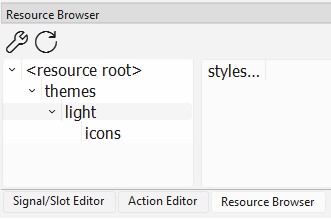

.. _info_theme:

=======================================
Snooz Theme Overview
=======================================

Snooz uses Qt Style Sheets (QSS) to define the visual appearance of its user interface across platforms (Windows, macOS, Linux). 
The styling is centralized in a .qss file.

Key Points:

- **Unified Look**: The .qss file ensures that widgets (buttons, labels, tabs, etc.) have a consistent look throughout the application.
- **Static Styling**: Unlike modern CSS, QSS does not support variables or functions, so themes must be manually maintained. Reference colors and design rules are often listed in comments at the top of the file to guide developers.
- **Light Theme Only** (for now): Snooz currently supports only a light theme. While support for multiple themes may be added in the future, any visual changes must be made manually by editing the .qss file and restarting the application.

How to Modify a Widget’s Color in the Snooz Theme
==================================================

To change the color of a widget (e.g., ``QPushButton``, ``QLabel``, ``QScrollBar``) in the Snooz interface:

1. **Locate the QSS file**

   The theme file is located at:
   
   ``snooz_workspace\snooz-toolbox-ceams\src\main\python\ui\themes\light\stylesheet.qss``

2. **Edit the style rule**

   Open ``stylesheet.qss`` in a text editor. Find or add the rule corresponding to the widget you want to modify.

3. **Recompile the resources**

   Snooz uses a Qt resource file (``.qrc``) to bundle the theme into the application.
   After modifying the ``.qss`` file, you must recompile the resource file so the changes are reflected in the application.
   
   The resource file is located at:

   ``snooz_workspace\snooz-toolbox-ceams\src\main\python\ui\themes.qrc``

   In VS Code, right-click on the ``themes.qrc`` file and select **"Compile Qt Resource file (rcc)"**.
   This will generate the file ``themes_rc.py`` next to the ``themes.qrc`` file.

   .. warning:: 
   
    Since the official resource file loaded by Snooz is located in the root of the Python source folder:
    ``snooz_workspace\snooz-toolbox-ceams\src\main\python``
    You must **copy and paste the newly compiled** ``themes_rc.py`` file into that location to overwrite the existing one.

Qt Resource File Integration in UIs
==================================================

The ``themes.qrc`` file, which bundles the stylesheet and other theme-related assets, must be added as a resource in each UI to ensure the theme is applied correctly.

To simplify this process, our utility script automatically generates modules, tools, and apps with the ``themes.qrc`` resource file already included, so you do not need to add it manually.

When editing a ``.ui`` file manually (e.g., in Qt Designer), make sure the resource is properly referenced so it will apply to any additional edits.  
The file should appear in the Resource Browser as shown in the picture below :

The following lines appear in the .ui file for a tool step (the path may differ for other components):

.. code-block:: xml

    <resources>
      <include location="../../../../../snooz-toolbox/src/main/python/ui/themes/themes.qrc"/>
    </resources>

When the .ui file is compiled into Python, the referenced resource file (e.g., themes.qrc) is not embedded in the generated .py file. 
Instead, the compiled Python file will simply include an import statement like:

.. code-block:: python
    
    import themes_rc

For this import to work correctly, the compiled themes_rc.py file must be available in Snooz’s root source directory:
``snooz_workspace\snooz-toolbox-ceams\src\main\python``

This is why you need to **copy and paste the newly compiled** ``themes_rc.py`` file into that location after recompiling the resources.
