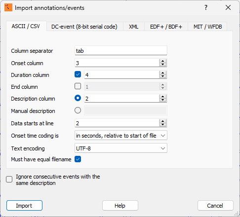

.. _EDFbrowser_compatibility:

==================================
EDFbrowser compatibility
==================================

We recommend to use `EDFbrowser <https://www.teuniz.net/edfbrowser/>`_ a free, open-source, multiplatform, universal viewer, annotator and toolbox intended for, but not limited to, time-series storage files like EEG, EMG, ECG, BioImpedance, etc.

EDFbrowser can open .edf file and import annotations from .tsv file via the menu **Tool -> Import Annotations -> ASCII/CSV**.
To import the Snooz annotations, set the options as shown in the image below, and press **Import**:  

.. note::

    - Only three columns out of five are imported into EDFbrowser.  
    - To make annotations channel-specific, add the channel label as a suffix to the annotation name using the format @@ (e.g., spindle@@C3). Snooz automatically generates this format to maintain compatibility with EDFbrowser. 
    - EDFbrowser does not support annotation groups. 

To display the hypnogram based on the Snooz annotations, navigate to **Windows -> Hypnogram**, set the options as shown in the image below, and press **Start**: 

