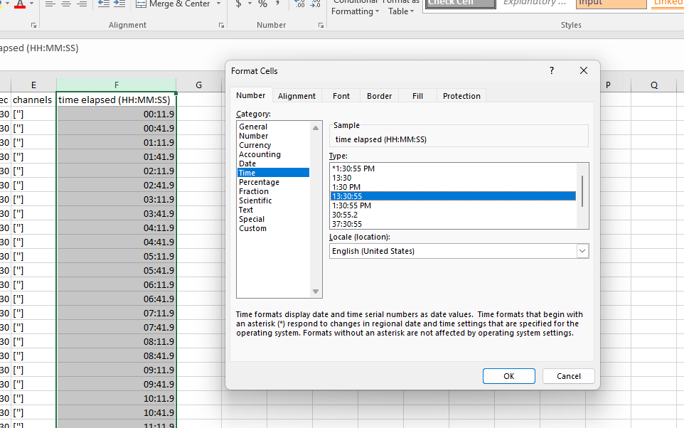

.. _accepted_format:

Polysomnography file format
==========================================================

European Data Format (EDF)
----------------------------------------------------------
| The primary accepted polysomnography format in Snooz is the European Data Format (EDF).
| For more details, see `European Data Format <https://www.edfplus.info/specs/edf.html>`_.

| Snooz can also read signals from EDF+. However, annotations must first be imported from the EDF+ file into a .tsv (Tab-Separated Value) file compatible with Snooz.
| See :ref:`EDF_Annotations_Importer` for more details. 

Additional PSG formats 
----------------------------------------------------------
| **Harmonie / Stellate (.SIG/.STS, up to version 6.2)**
| Available to all users.  The reader includes no proprietary code. The .SIG signal file and the .STS annotation file must share the same filename and be stored in the same directory.

| **NATUS (version 9.1) — Restricted to CÉAMS users only**
| The reader includes proprietary code and cannot be distributed publicly. The entire subject folder is required (typically including .eeg, .ent, .epo, etc.).

.. note::
    CÉAMS - Centre d'études avancées en médecine du sommeil (`ceams-carsm <https://ceams-carsm.ca/en/>`_)

Annotations file format
==========================================================

The columns of the annotations file are as follows:

1. **group** : The category of the annotation (annotations with different names can be grouped into the same category), e.g. artifact
2. **name**: The text label of the annotation, e.g., art_snooz
3. **start_sec**: The onset of the annotation in seconds, e.g., 300
4. **duration_sec** : The duration of the annotation in second, e.g., 30
5. **channels** : The list of channels on which the annotation occurs, e.g., ['LOC', 'ROC']
6. [Optional Column: **time elapsed (HH:MM:SS)**] : The time elapsed since the beginning of the recording, e.g., 00:05:00

.. note::
   - The **time elapsed (HH:MM:SS)** column is optional and intended solely for human readability; it is not processed by Snooz.  
   - If this column is omitted, all tools will function normally.  
   - When Snooz generates output .tsv files, the time elapsed column is automatically calculated from the start of the recording using the **start_sec** column.

.. warning::
   The cells regarding the **time elapsed (HH:MM:SS)** column need to be properly configured in Excel or any other spreadsheet application to ensure that the time elapsed column has the correct format.
   
   For example, the following figure shows the configuration in **Excel** for the **time elapsed (HH:MM:SS)** column.

To have an example of the Snooz annotations file see `Snooz_accessory_file.tsv <https://f004.backblazeb2.com/file/snooz-release/doc/Snooz_accessory_file.tsv>`_

The Snooz accessory .tsv file is human-readable and can be opened in any text editor or spreadsheet application (such as Excel). 
Items are separated by tabs, and decimal points are marked with a dot. 
The encoding format is UTF-8.

- **Item separator** : \t
- **Decimal separator** : .
- **Encoder format** : UTF-8

Many converters have been implemented in Snooz in order to create the Snooz accessory file for your cohort.
I recommend exploring the preprocessing category to see if your annotation files can be converted into Snooz accessory files.
The Snooz accessory file can be imported in the open-source universal viewer `EDFbrowser <https://www.teuniz.net/edfbrowser/>`_.
For more details, see :ref:`EDFbrowser_compatibility`.

Sleep staging
==========================================================

Sleep stages are represented by numbers in Snooz, as shown in the lookup table below:

.. list-table:: Sleep Stages Definition Table
   :widths: 30 30
   :header-rows: 1

   * - Description
     - name
   * - Awake
     - 0
   * - N1
     - 1
   * - N2
     - 2
   * - N3
     - 3
   * - REM
     - 5
   * - Unscored
     - 9

Sleep staging is included in the annotation file. Snooz expects sleep staging annotations to be grouped by **stage**, and the annotation name represents the corresponding stage.

.. csv-table:: The Snooz annotations for sleep stages
   :file: snooz_sleep_stages.tsv
   :delim: 0x09
   :header-rows: 1

.. warning::
   Users can rename their sleep stages according to this table using the "Edit Annotations" tool under the Preprocessing menu.  
   **S4 stages are not supported in Snooz**—please rename them as N3 for minimal compatibility.

.. note::
   To download a sample accessory file containing only sleep stages : `snooz_sleep_stages.tsv <https://f004.backblazeb2.com/file/snooz-release/doc/snooz_sleep_stages.tsv>`_
