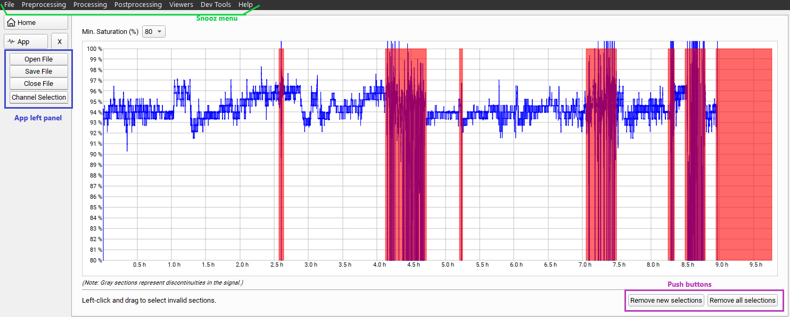

.. _Oximeter: 

===================
Oximeter
===================

Description
-----------------

This viewer allows you to mark invalid sections on the oximeter channel in order 
to generate a valid :ref:`Oxygen_saturation_report_csv` via the tool :ref:`Oxygen_saturation_report`. 
The invalid sections marked are saved as annotations in the accessory file.

**Open a PSG file**

| There are two mays to open a PSG for the Oximeter Viewer.
| The user can open a PSG file by navigating to the Snnoz menu :

1. "File" -> "Open", and select the Oximeter app.
2. "Manual Review" -> "Oximeter", and click on "Open File" in the left panel of the Oximeter Viewer.

Select the "Montage" and the label to identify the "Oximeter channel".

.. warning::
    
    Please, do not interact with the Snooz interface while the file is loading.

**Mark an invalid sections**

To define an invalid section, left-click the mouse and drag to select the period of time the section is invalid.

.. note::
    
    The invalid sections are displayed in red on the oximeter channel. 

**Remove invalid sections**

Two push buttons allow you to delete invalid sections.  

* Remove new selections : remove all new selections, the ones just created via the Oximeter viewer, and keep the ones saved in the accessory file.
* Remove all selections : remove all selections, including the ones already saved in the accessory file.

**Save the selections**

To save the selections as annotations in the accessory file, press the "Save File" button in the left panel of the viewer.  
A dialog window will inform the user when the file is saved.

The invalid section annotations are defined as :
* `group` label: SpO2
* `name` label: art_SpO2
* `start_sec`: start time of the invalid section in seconds elapsed from the beginning of the recording.
* `duration_sec` : the duration of the invalid section in seconds.
* `channels` : the list of channels on which the section is invalid, e.g., the oximeter channel, such as 'SpO2'.

