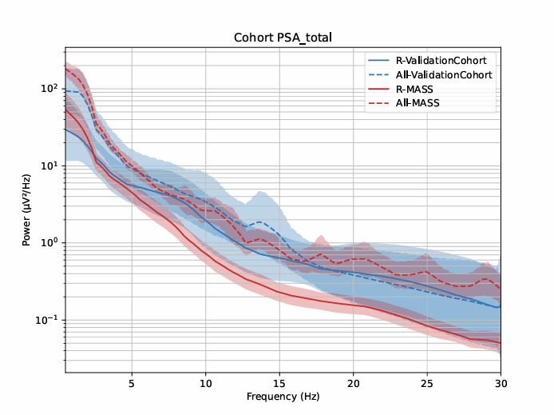
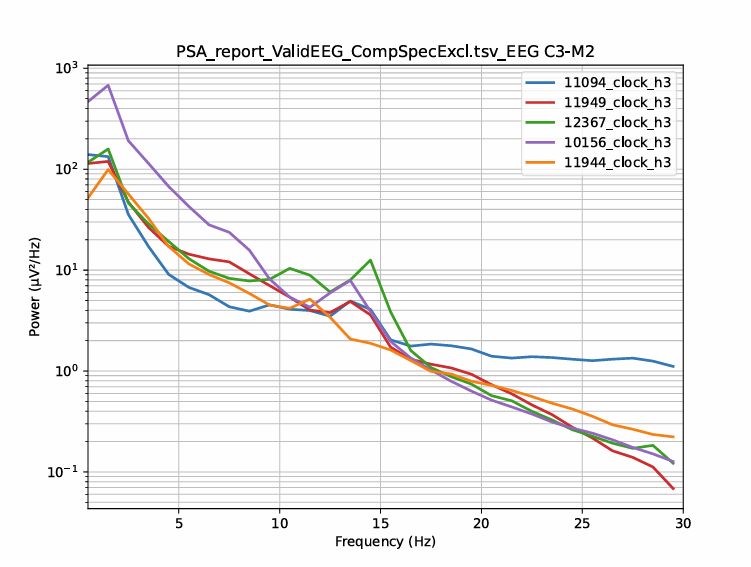
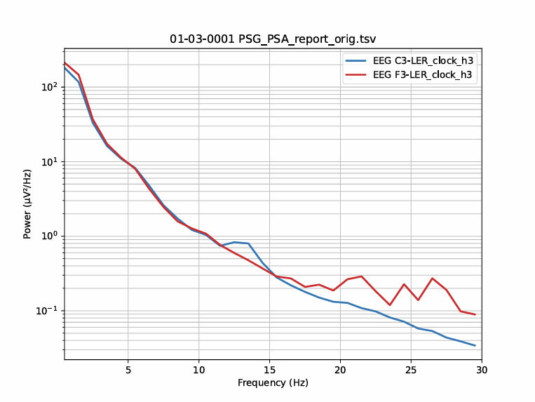

.. _PSAImages:

=================================================
PSA Images
=================================================

Description
-----------------

This tool allows to generate images of power spectral analysis (PSA) of signals, channels, and region of interestes (ROIs).
Besides, the user can generate images based on the prefered sleep stages, hour, cycle, and the total duration of the sleep.

Steps
-----------------

**1 - Input Files :**

	- Add your PSA report file (.tsv), which is generated from the PSA tool.
	- Select the channels in the "Subject Channel List" or "Cohort Channel List".

	- ROIs :
	    - Add ROIs and select them. 
	    - You can create ROIs to group channels with similar labels (e.g., C3-A2, C3-M2, C3) together.  
	    - You can choose to analyze either channels or ROIs, or both.

.. NOTE::

     To modify the channel names displayed on the plot, we recommend first using the "PSA Cohort Review" tool.
     Customize the names in the generated report, then use that report in this tool for visualization purposes.

**2 - Group Definition :**
	- Assign a condition group to each report file.  Any condition group label is accepted.  
	- The number of condition groups is unlimited.

**3 - Output Files :**
	- Define the parameters for generating the images. 
	- Images can be generated at either the subject level or the cohort level, or both.

	- You have the option to generate individual pictures 
	- for each channel/ROI or combine them into a single picture.
	
	- Select the prefered sleep stages, and section to display the PSA images.

	- Specify desired display options, such as plotting the mean PSA signal curve and setting axis limits. (For more options look at the "Colors" settings page in the left panel).

	- Select the output folder to save the images.

Example of the Generated Images
---------------------------------

