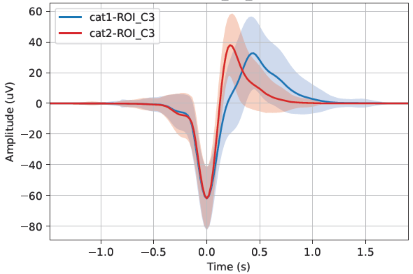
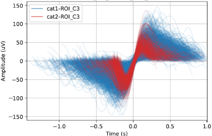

.. _Slow_Wave_Images_Generator:

=================================================
Slow Wave Images Generator
=================================================

Description
-----------------

This tool allows to generate images of slow wave (SW) signal curves.  

.. warning::

   Make sure the SW have been already detected and the annotations have been saved in the accessory file.

This generator uses the files produced by the tools :ref:`Slow_wave_detection` or :ref:`Slow_wave_classifier` if you are interested in the SW category. 
The SW characteristics are used as references to properly align the superimposed signals of SW, therefore, this tool requires the Slow Wave characteristics files. 
The files contain the signal characteristics of each slow wave event, optionally including the SW category. There is one file per recording, with one row per event.

.. warning::

   The option to generate the needed input files has to be checked by the user on step "4 - Output Files" in the :ref:`Slow_wave_detection` tool.

Steps
-----------------

**1 - Input Files**

Start by opening your PSG files (.edf, .eeg or .sts).

* The .tsv file is also needed for the EDF format.

* The .sig file is also needed for Stellate format.

* The whole NATUS subject folder is also needed for the .eeg format.

Select the montage and the channels for each PSG.  

.. warning::

   Make sure the SW have been already detected in the selected channels.

**2 - Group Definition**

Assign a condition group to each PSG file.  Any condition group label is accepted.  The number of condition groups is unlimited.

**3 - SW Characteristics**

Choose the folder to load the Slow Wave Characteristics files (generated by the :ref:`Slow_wave_detection` tool, from the "Processing" menu).
The characteristics are used as references to properly align the superimposed signals of slow waves.
If the slow wave category is included in the files, the information can be used to group slow wave signals in the generated pictures.

**4 - SW Annotation**

Select the slow wave annotation for each PSG file.

**5 - ROIs**

Add Regions of Interest (ROIs) and label them. You can create ROIs to group channels with similar labels (e.g., C3-A2, C3-M2, C3) together.  
Select the channel or ROI you are interested in. You can choose to analyze either channels or ROIs, or both.

**6 - Output Files**

Define the parameters for generating the images. 
Images can be generated at either the subject level or the cohort level, or both. 
You have the option to generate individual pictures for each channel/ROI or combine them into a single picture. 

If the :ref:`Slow_wave_classifier` tool has been run on the data, slow wave categories can be distinguished in the pictures.

Specify desired display options, such as plotting the mean slow wave signal curve and setting axis limits. (For more options look at the "Colors" settings page in the left panel).
Select the output folder to save the images.

