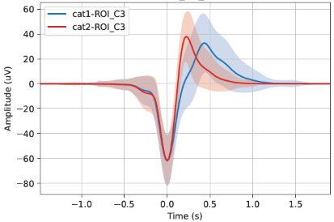
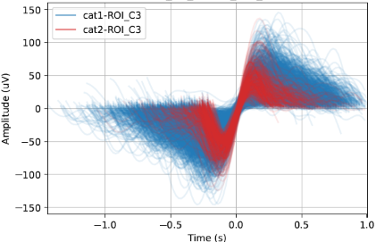
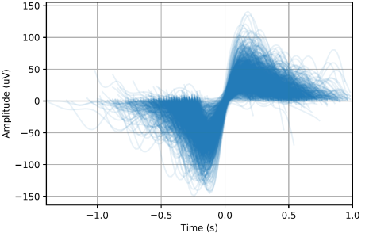
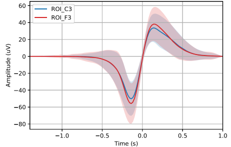
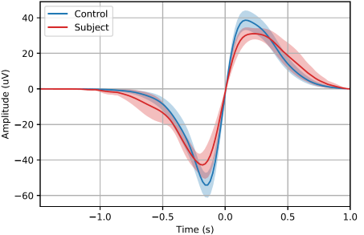
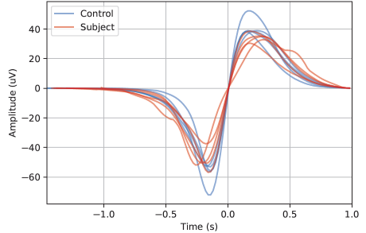

.. _Slow_Wave_Images_Generator:

=================================================
Visualize Slow Waves
=================================================

This tool allows to generate images of slow wave (SW) signal curves.  

.. warning::

   Make sure the SW have been already detected and the annotations have been saved in the accessory file.

This generator uses the files produced by the tools :ref:`Slow_wave_detection` or :ref:`Slow_wave_classifier` if you are interested in the SW category. 
The SW characteristics are used as references to properly align the superimposed signals of SW, therefore, this tool requires the Slow Wave characteristics files. 
The files contain the signal characteristics of each slow wave event, optionally including the SW category. There is one file per recording, with one row per event.

.. warning::

   The option to generate the needed input files has to be checked by the user on step "4 - Output Files" in the :ref:`Slow_wave_detection` tool.

Steps
-----------------

**1 - Input Files**

Start by opening your PSG files (.edf, .sts or .eeg). 

- **European Data Format (EDF)** : 
  
  The corresponding .tsv file is required with .edf. Both files must be saved in the same directory and share the exact same filename.

- **Stellate format (up to version 6.2)** : 
  
  The corresponding .sig file is required with the .sts. Both files must be saved in the same directory and share the exact same filename.

- **NATUS format (version 9.1)** : 
  
  (*CEAMS users only*) The entire NATUS subject folder is required.

For more details on accepted formats, see :ref:`accepted_format`.

.. warning::

   Make sure the SW have been already detected in the selected channels.

**2 - Group Definition**

Assign a condition group to each PSG file.  Any condition group label is accepted.  The number of condition groups is unlimited.

**3 - SW Characteristics**

Choose the folder to load the Slow Wave Characteristics files (generated by the :ref:`Slow_wave_detection` tool, from the "Processing" menu).
The characteristics are used as references to properly align the superimposed signals of slow waves.
If the slow wave category is included in the files, the information can be used to group slow wave signals in the generated pictures.

**4 - SW Annotation**

Select the slow wave annotation for each PSG file.

**5 - ROIs**

Add Regions of Interest (ROIs) and label them. You can create ROIs to group channels with similar labels (e.g., C3-A2, C3-M2, C3) together.  
Select the channel or ROI you are interested in. You can choose to analyze either channels or ROIs, or both.

**6 - Output Files**

Define the parameters for generating the images.

Images can be generated at the subject level, the cohort level, or both. 

**Subject level:**

You can generate individual images for each channel/ROI to examine the set of slow-wave events, or combine all channels/ROIs into a single image showing the averaged slow-wave curve.

Below are two examples: the first image shows all slow-wave events detected for one channel, and the second image shows the averaged slow-wave curve with its standard deviation for that same channel.

**Cohort level:**

Start by selecting a display option—for example, plotting the mean with or without the standard deviation (STD), or plotting all subjects within each group.
You can generate a single image for the entire cohort, where curves are averaged across all selected channels/ROIs, or generate one image per channel/ROI.

Below are two examples: the first image shows the averaged slow-wave curve with standard deviation across all subjects in each group, and the second image shows the individual averaged curves for each subject within each group.

If the :ref:`Slow_wave_classifier` tool has been run on the data, slow-wave categories can be visualized in the images.

Specify axis options, such as setting axis limits or displaying negative values upward.

For additional customization, refer to the Colors and Slow Wave Alignment settings in the left panel.

Finally, select the output folder where the images will be saved.

Version History
-----------------

* v2.0.0 : Distributed with CEAMS package version 7.2.0 — Snooz beta 2.0.1
    - Initial release of the tool.

* v2.3.0 : Distributed with CEAMS package version 7.3.0 — Snooz beta 3.0.0
    - Refactor Visualize Slow Wave for clarity especially the output file step.

