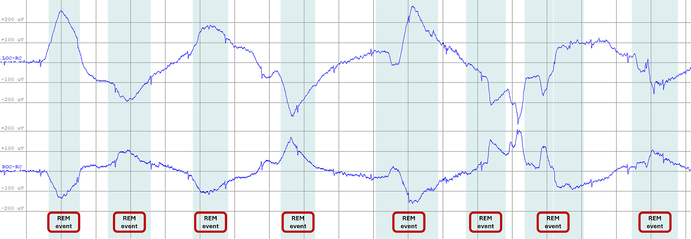

.. _DetectREMsYASA:

===============================
Detect REMs YASA
===============================

Description
-----------

This tool utilizes the Yet Another Splindle Algorithm (YASA) rapid eye movments (REMs) detector algorithm.

Algorithm Details
-----------------

This algorithm uses the idea from the methodologies proposed in [1] and [2], primarily building upon Agwal’s [2] approach, which applies amplitude thresholding to the negative product of the LOC and ROC filtered signals.
Using this technique, the algorithm identifies signal peaks and extracts key features, including the duration of the REM period, the peak absolute values of ROC and LOC, as well as the absolute rise and fall slopes for both signals.

To ensure reliable performance, the algorithm requires a minimum of 50 detected REMs to apply its model, which is based on the IsolationForest random forest classifier.
Additionally, if the user selects the "remove outlier" option as True, any outliers detected after applying the IsolationForest will be excluded from the final detection results.

**- Usage points:**
   - All output parameters of this algorithm are computed using the filtered LOC and ROC signals. The filtering process is based on the thresholds defined in the DetectionStep.
   - For optimal results, the user should apply this detection only to artifact-free REM sleep data.

The example of the REMs events in two EOG channels left and right are shown in **Figure 1**.

.. rst-class:: center-caption

**Figure 1:** The example of REMs events in two EOG channels left and right

Input
-----
PSG files including header and events are needed (all saved in the same directory).

 - European Data Format (EDF) : .edf and .tsv files with the exact same filename.
 - Stellate : .sig and .sts files with the exact same filename.
 - NATUS :  the whole NATUS subject folder

The annotations files have to include the sleep staging.

Channels:
This tool requires the selection of 2 EOG channels per recording for REMs detection.

Output
------
The REMs detected events are added in the annotations files (.tsv, .sts or .ent) depending of the format used.
If the annotations file already includes the group event to be added, the existing entries will be removed before adding the new ones.

Each events is defined by : 
   1. group : The group where the events are added (i.e. REM).
   2. name : The name of the event (i.e. YASA_REM)
   3. start_sec : The onset of the event in second. 
   4. duration_sec : The duration of the event in second.
   5. channels : The list of channels on which the event occurs.

Detector Step
----------------
In this step the user can set the parameters for the detection of REMs using YASA. The following parameters can be adjusted:
   - **REMs Event group**: The group category in the annotation file (default is "REM").
   - **REMs Event name**: The name of the event in the annotation file (default is "YASA_REM").
   - **Hypnogram Loaded**: If the hypnogram is loaded, the algorithm will use it to filter out REMs.
   - **Amplitue**: Minimum and maximum amplitude of the peak of the REM.
   - **Duration**: Minimum and maximum duration of the REM.
   - **REM Frequency**: Minimum and maximum frequency of the REM.
   - **Relative Prominence**: Scales the minumum prominence threshold as a fraction of minimum amplitude. (e.g., 0.5 means peaks must stand out by at least half of the minimum amplitude).
   - **Sleep Stages**: If the hypnogram is loaded, the detection will only be applied to the values defined in "Sleep Stages": Default = 5 (REM).
   - **Remove outliers**: If YES, the algorithm will remove outliers detected by the IsolationForest model. Note that this step will only be applied if the number of detected REMs is greater than 50.
   
References
----------
[1] Yetton, B. D., et al. (2016). Automatic detection of rapid eye movements (REMs):A machine learning approach. Journal of neuroscience methods, 259, 72-82.

[2] Agarwal, R., et al. (2005). Detection of rapid-eye movements in sleep studies. IEEE Transactions on biomedical engineering, 52(8), 1390-1396.