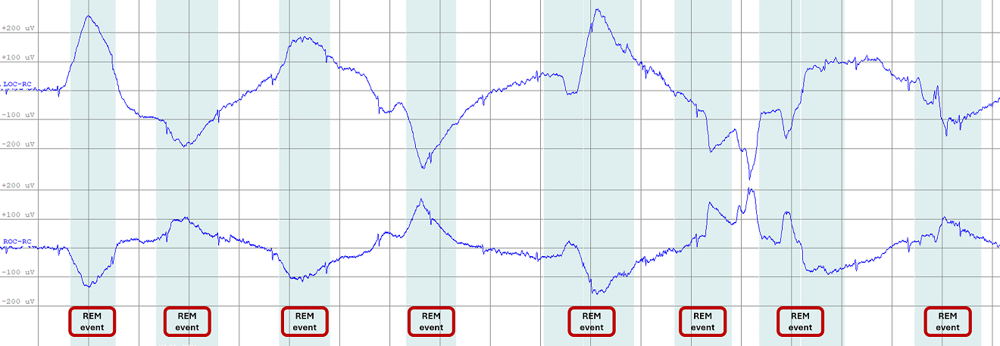

.. _DetectREMsYASA:

===============================
Detect REM events with YASA
===============================

This tool utilizes the Yet Another Splindle Algorithm (YASA) rapid eye movments (REMs) detector algorithm. It also classifies the detected REMs into phasic and tonic mini-epochs.

Algorithm Details
------------------

This algorithm uses the idea from the methodologies proposed in [1] and [2], primarily building upon Agwal’s [2] approach, which applies amplitude thresholding to the negative product of the LOC and ROC filtered signals.
Using this technique, the algorithm identifies signal peaks and extracts key features, including the duration of the REM period, the peak absolute values of ROC and LOC, as well as the absolute rise and fall slopes for both signals.

To ensure reliable performance, the algorithm requires a minimum of 50 detected REMs to apply its model, which is based on the IsolationForest random forest classifier.
Additionally, if the user selects the "remove outlier" option as True, any outliers detected after applying the IsolationForest will be excluded from the final detection results.

.. note:: Only REMs events that fall within at least one-third of the REM sleep stage are retained. Events occurring outside this threshold are discarded. (This rule is important when a REM event is detected at the transition of two sleep stages.)

**- Usage points:**
   - All output parameters of this algorithm are computed using the filtered LOC and ROC signals. The filtering process is based on the thresholds defined in the DetectionStep.
   - For optimal results, the user should apply this detection only to artifact-free REM sleep data.

The example of the REMs events in two EOG channels left and right are shown in **Figure 1**.

.. rst-class:: center-caption

**Figure 1:** The example of REMs events in two EOG channels left and right

Input
-----
PSG files including header and events are needed.

- **European Data Format (EDF)** : 
  
  The corresponding .tsv file is required. Both files must be saved in the same directory and share the exact same filename.

- **Stellate format (up to version 6.2)** : 
  
  The corresponding .sig file is required with the .sts. Both files must be saved in the same directory and share the exact same filename.

- **NATUS format (version 9.1)** : 
  
  (*CEAMS users only*) The entire NATUS subject folder is required.

For more details on accepted formats, see :ref:`accepted_format`.

.. note:: Annotation files are not required for the functionality of this tool. However, if provided, they must include sleep staging. The REMs report is only generated when an annotation file is supplied. Without one, the tool performs REMs detection solely based on the algorithm's detection criteria, and detections may occur in any sleep stage.

.. note:: If you do not have annotation files, we highly recommend using the "Score Sleep Stages with YASA" tool first to generate an annotation file, and then running this tool for more reliable REMs detection.

Channels:
This tool requires the selection of 2 EOG channels per recording for REMs detection.

Detector Step
----------------
In this step the user can set the parameters for the detection of REMs using YASA. The following parameters can be adjusted:
   - **REMs event group**: The group category in the annotation file (default is "REM").
   - **REMs event name**: The name of the event in the annotation file (default is "YASA_REM").
   - **Amplitude**: Minimum and maximum amplitude of the peak of the REM.
   - **Duration**: Minimum and maximum duration of the REM.
   - **REM frequency**: Minimum and maximum frequency of the REM.
   - **Relative prominence**: Scales the minimum prominence threshold as a fraction of minimum amplitude. (e.g., 0.5 means peaks must stand out by at least half of the minimum amplitude).
   - **Remove outliers**: If YES, the algorithm will remove outliers detected by the IsolationForest model. Note that this step will only be applied if the number of detected REMs is greater than 50.
   - **Sleep stages selection**: If "Scored" is selected, the algorithm will only consider REMs stages for detection. If "Unscored" is selected, the algorithm will consider all sleep stages for detection and you don't need to provide an annotation file.

Mini-epochs Classification Step
----------------
In this step, the user can set the parameters for the classification of REMs into phasic and tonic mini-epochs.

General definition:
   - **Tonic REM**: Corresponds to more stable REM activity with minimal eye movements and lower physiological variability.
   - **Phasic REM**: is characterized by bursts of rapid eye movements, transient muscle activity, and increased neural and autonomic activation. This separation enables more detailed investigation of REM sleep dynamics and related biomarkers.

Mini-epochs classification parameters:
   - **Mini-epoch event group**: The group category in the annotation file (default is "REM").
   - **Phasic/Tonic event name**: The name of the event in the annotation file (default is "EOG_Phasice" and "EOG_Tonic").
   - **Length of mini-epoch**: The duration of the mini-epoch in seconds (default is 3 seconds).

Output
------
The REMs detected events are added in the annotations files (.tsv, .sts or .ent) depending of the format used.
If the annotations file already includes the group event to be added, the existing entries will be removed before adding the new ones.

Each event is defined by : 
   1. group : The group where the events are added (i.e. REM).
   2. name : The name of the event (i.e. YASA_REM)
   3. start_sec : The onset of the event in second. 
   4. duration_sec : The duration of the event in second.
   5. channels : The list of channels on which the event occurs.

The tool also provides two folders of **REMs characteristics** and **REMs sleep stages** including some parameters for each specific REM event for more detailed analysis. The **characteristics folder** includes two files:
   - **Event file** : Contains all events in Snooz annotation format.
   - **Summary file** : contains the following characteristics of the REMs:
      - LOC and ROC absolute amplitude at REM peak (in uV)
      - LOC and ROC absolute rise and fall slopes (in uV/s)
      - Start, end, duration, and peak of each REM event (in seconds)

Report
----------------
.. toctree::
   DetectREMsYASA/REMsReport_info

References
----------
[1] Yetton, B. D., et al. (2016). Automatic detection of rapid eye movements (REMs):A machine learning approach. Journal of neuroscience methods, 259, 72-82.

[2] Agarwal, R., et al. (2005). Detection of rapid-eye movements in sleep studies. IEEE Transactions on biomedical engineering, 52(8), 1390-1396.

Version History
-----------------

* v2.0.0 : Distributed with CEAMS package version 7.0.0 — Snooz beta 2.0.0
    - Initial release of the tool.
    
* v3.3.0 : Distributed with CEAMS package version 7.3.0 - Snooz beta 3.0.0
    - REMs report added to the output of the tool.
    - The UI of the tool has been updated to be more user-friendly.
    - Fixed reporting of events starting at sleep stage transitions.
    - Improve path, filename, and extension handling for sleep cycle warning log file.
      
* v3.4.0 : Distributed with CEAMS package version 7.4.0 — Snooz 1.0.0
    - Add error handling workflow for PSG loading from workspaces and display failed files in the UI.
    - Add error handling workflow for duplicated sleep stages.

* v3.5.0 : Distributed with CEAMS package version 7.5.0 — Snooz 1.1.0
    - Mini-epochs classification step added to the tool.
    - Add REMs report detailed information in a .tsv file.
