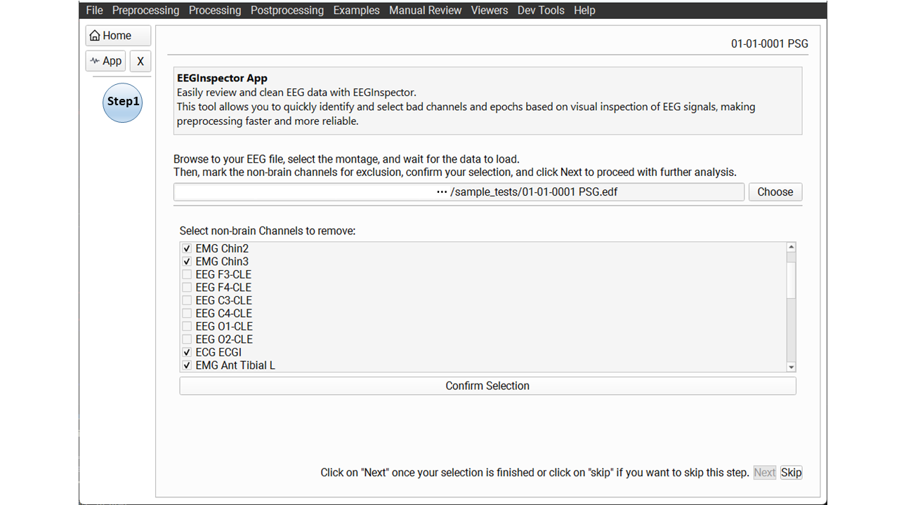
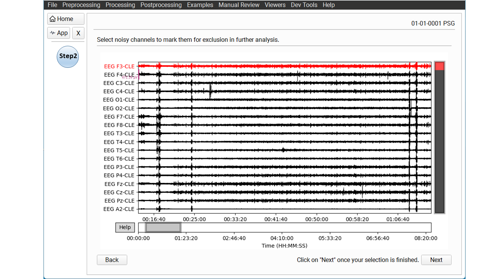
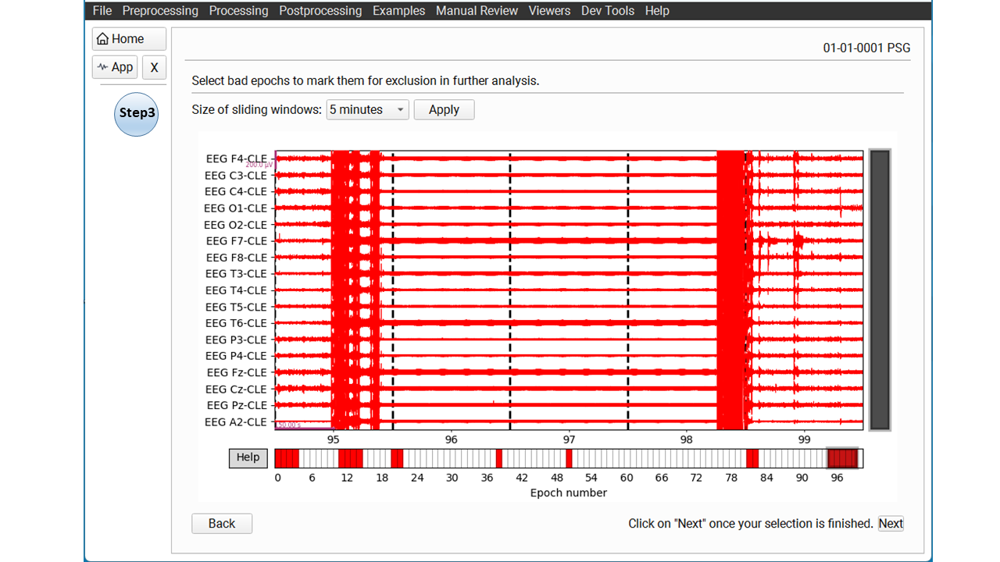
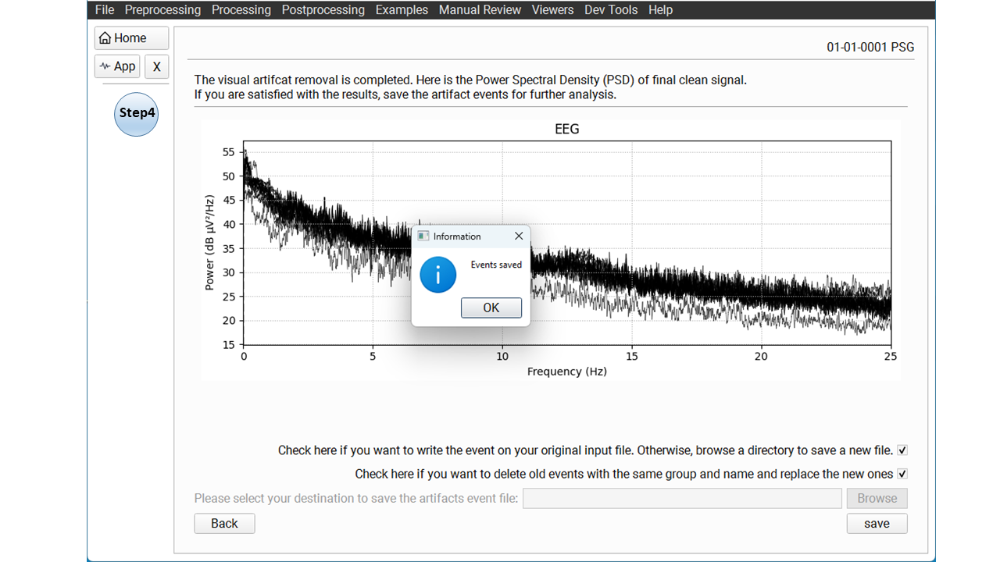

.. _EEGInspector: 

=======================
Inspect EEG channels
=======================

**EEG Inspector** is an interactive app for visually inspecting EEG data and creating artifact annotations for further analysis in Snooz.  
With the EEG Inspector, you can easily mark non-brain channels, bad channels, and noisy epochs to generate reliable annotations for preprocessing.

The tool works in several simple steps:

1. **Open your EEG file** and select a montage.
2. **Select non-brain channels** to mark them for exclusion.
3. **Mark fully artifact channels** via visual inspection.
4. **Inspect and mark noisy epochs** by segmenting your data.
5. **Review the Power Spectral Density (PSD)** of the cleaned signal.
6. **Save your annotations** for use in Snooz or other analysis tools.

Here is the overview of the steps taken to prepare annotations for a sample dataset:

**Step 1** – Open the EEG Inspector app and select a montage, then select non-brain channels (e.g., ECG, EOG) for exclusion.

**Step 2** – Visually inspect the EEG and mark fully artifact channels.

**Step 3** – Segment the data into epochs and mark noisy ones.

**Step 4** – Check the PSD of cleaned signal and save the annotations properly.

Open your EEG file
-----------------------

To open the EEG Inspector in Snooz:

* Navigate to **"Preprocessing" → "Inspect EEG channels"**.

Then, use the **Browse** button to select your EEG file.

* After opening, select the appropriate montage.
* A table will list all available channels.

Select non-brain channels
-----------------------------

The app may automatically suggest common non-brain channels.

* For **128-channel** and **256-channel** montages, face and peripheral electrodes are pre-selected automatically when channel names are recognized.
* Keyword-based sensors (for example EOG, EMG, ECG) are also suggested when their channel names match known patterns.
* If the suggested selection is not correct, you can **uncheck** any channels or **check** the correct ones manually.
* Mark channels such as EOG, EMG, ECG, or other sensors that should be excluded.
* Click **Confirm Selection** when done, or click **Skip** if you don’t need to remove any channels.

Wait for the data to load.

.. warning::
    
    Do not interact with the Snooz interface while the file is loading.

.. warning::

   The EEG Inspector currently supports only **continuous EEG signals**.  
   If your signal is discontinuous, you will see an error.  
   Support for discontinuous signals will be added in a future release.

.. note::

   For visualization only, signals are resampled to 256 Hz or 200 Hz (depending on the original sampling rate) and low-pass filtered at 100 Hz. This does **not** modify your original data.

Mark fully artifact channels
---------------------------------

Once the data loads, a scrolling EEG viewer will open.

* Click channels in the plot to mark them as **fully artifact** — they will appear in **red**.
* Use the **→** and **←** keys to scroll horizontally.
* Press **+** or **-** to adjust amplitude scaling.
* Hold **Shift** + **→** to scroll faster.
* For more shortcuts, press **Help** in the bottom-left corner.

.. note::

   For long sleep files, scrolling may have a small delay — please be patient.

When finished, click **Next**.

Inspect and mark noisy epochs
------------------------------------

Your data will be automatically divided into epochs:

* If your file is **over 1 hour**, you can choose **20 min** or **60 min** epochs.
* If under 1 hour, you can choose **10 s** or **30 s** epochs.

Select the desired epoch length, click **Apply**, and inspect the segments.

* Click on a noisy epoch to mark it — it will turn **red**.

Click **Next** when finished.

Review the PSD
-------------------

In the final step, the app shows the **Power Spectral Density (PSD)** of the cleaned data.

* Check the PSD to confirm that your signal is clean.
* The page reminds you that any previous EEG Inspector annotations will be replaced with the new ones when you save.

If satisfied, click **Save**.

Save annotations
----------------------

Annotations are always written to the **opened EEG / PSG file** (the same file you selected at the start).

* Press **Save** — a dialog confirms that the EEG Inspector events were saved.
* Any previous EEG Inspector annotations are **replaced** with the new ones.
  Only events with ``group`` ``art_inspector`` and names ``non_brain``, ``art_channel``, or ``art_epoch`` are removed and rewritten.
  Other annotations in the file are left unchanged.
* At the same time, the PSD of the cleaned signal is saved next to the input file as ``{filename}_PSD.png``,
  where ``{filename}`` is the input file name without its extension (shown at the top left of the app).

Annotations are saved as: 

* `group`: `art_inspector`
* `name`: `non_brain`, `art_channel` or `art_epoch`
* `start_sec`: start time in seconds
* `duration_sec`: duration in seconds
* `channels`: list of affected channels

Your EEG data is now ready for reliable further processing in Snooz.

Version History
-----------------

* v2.2.0 : Distributed with CEAMS package version 7.3.0 — Snooz beta 3.0.0
    - Initial release of the tool.
    
* v2.3.0 : Distributed with CEAMS package version 7.4.0 — Snooz 1.0.0
    - Improved PSG reader error handling for data-loading failures.

* v2.4.0 : Distributed with CEAMS package version 7.5.0
    - Automatic non-brain channel suggestions for 256-channel EGI / GSN HydroCel montages.
    - Annotations are always saved to the opened input file.
    - Previous ``art_inspector`` annotations are always replaced on save.
    - Automatic export of the cleaned PSD as ``{filename}_PSD.png`` next to the input file.
