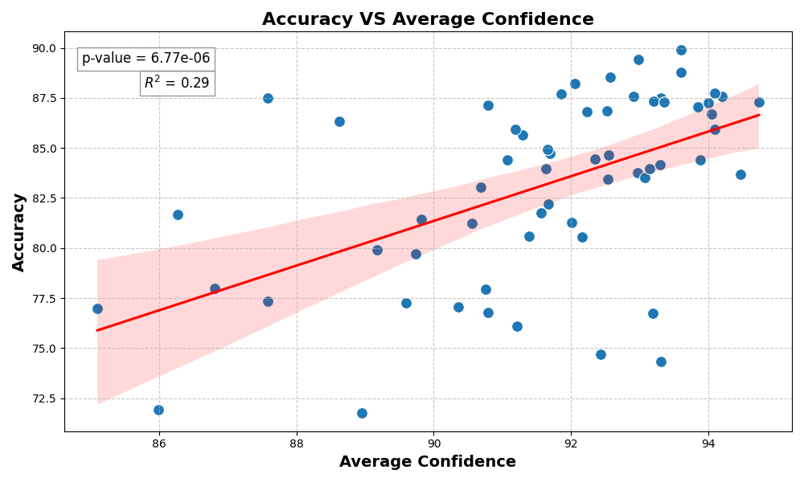
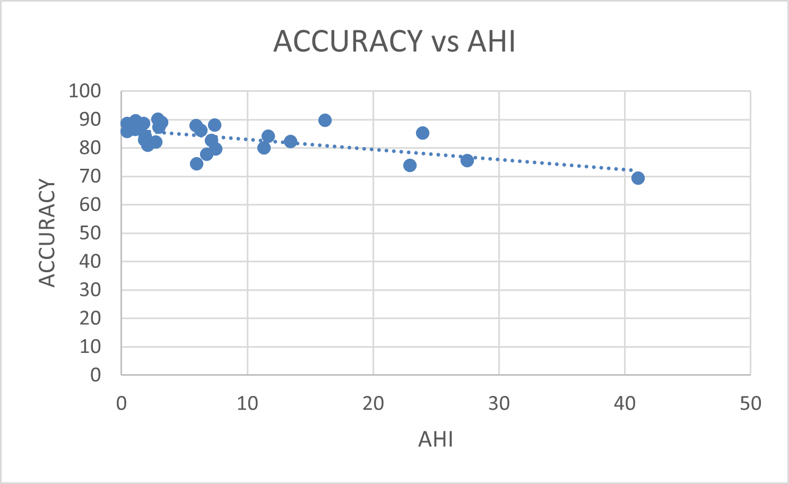
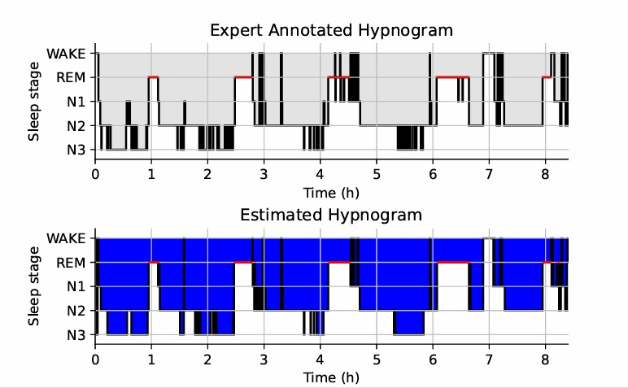
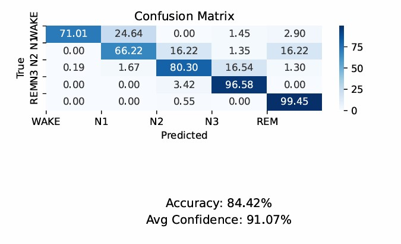

.. _YASA_Automatic_Sleep_Scoring:

===============================
YASA Automatic Sleep Scoring
===============================

Description
-----------

The YASA tool automatically detects sleep stages from polysomnography (PSG) files. 
It processes the entire recording in 30-second epochs, assigning a sleep stage to each epoch. 
The tool can perform detection using a single EEG electrode, with central electrodes (e.g., C3, C4) being preferred.

To enhance the algorithm's performance, you can optionally include one EOG (electrooculography) and one EMG (electromyography) channel, which can improve classification accuracy. 
For more details, refer to the official YASA documentation: https://raphaelvallat.com/yasa/.

Additionally, in Snooz, you can select up to four high-priority EEG channels as input. 
This allows the tool to determine the result with the highest confidence for each channel.

Algorithm Details
-----------------

The YASA sleep staging algorithm is an open-source tool trained on over 30,000 hours of polysomnographic (PSG) sleep data across diverse populations.

**Data Processing:**
- The algorithm uses a central EEG channel, along with optional EOG and EMG channels.
- Signals are downsampled to 100 Hz and bandpass-filtered between 0.4 Hz and 30 Hz.

**Feature Extraction:**
- Time and frequency domain features are extracted from the EEG signal, and optionally from the EOG and EMG signals.
- Features are calculated for each 30-second epoch of raw data.

**Smoothing and Normalization:**
- A smoothing approach is applied to incorporate contextual information across features.
- Smoothed features are z-scored for each night.

**Machine Learning Classification:**
- A LightGBM classifier, a tree-based gradient-boosting model, is used for sleep stage classification.

**Performance Evaluation:**
- The algorithm's performance is evaluated using standardized metrics, including:
  - Accuracy
  - Cohen's kappa
  - Matthews correlation coefficient
  - Confusion matrices
  - F1-scores

Output Files
------------
The YASA sleep scoring tool supports various input file formats, including EDF, NATUS, and STS. 
The output is an accessory file containing the predicted sleep stages.

Steps
-----

**1. Input Files**
- Open your PSG files (e.g., .edf, .eeg, or .sts).
  
  **Validation Mode:**
  - If validating the automatic scoring, provide the following accessory files in the same folder as the PSG file:
    - For EDF format: A .tsv file is required.
    - For Stellate format: A .sig file is required.
    - For NATUS format: The entire subject folder is required.
  
  **Prediction Mode:**
  - No accessory files are needed.

- Use the settings from PSGreader to select the montage and channels for sleep scoring.
- You can run the tool in batch mode to score multiple files simultaneously.
- The only mandatory channel is the EEG channel. For improved accuracy, you can optionally include one EOG and one EMG channel.
- You can select up to four high-priority EEG channels as input, enabling the tool to determine the result with the highest confidence for each channel.
- Ensure that aliases are assigned to distinguish the selected channels.

**2. Export Scoring**
- Choose between prediction or validation mode.
- Define a new group name for the predicted scoring in the accessory file.

  .. warning::
     Changing the group name "stage" to a different value may prevent Snooz from correctly identifying sleep stages in other tools.

- For prediction, no accessory files are required.
- For validation, provide the necessary accessory files and specify the destination to save the results.

Evaluation of YASA Sleep Scoring Algorithm
=========================================

The YASA sleep scoring algorithm underwent rigorous evaluation on multiple datasets before its integration into Snooz. Below are some key findings from this evaluation:

1. **Correlation Between Accuracy and Confidence**
   - The algorithm's accuracy on the SS3 subset of the MASS dataset demonstrates a positive correlation with the average confidence in the decision-making process. This relationship is illustrated in **Figure 1**.
   - These findings align with the results reported in the original YASA paper [1]_, further validating the algorithm's reliability.

.. _fig-accuracy-confidence:

.. rst-class:: center-caption

**Figure 1:** Correlation between accuracy and confidence

2. **Performance on a Private NATUS Dataset**
   - YASA was also evaluated on a private dataset in NATUS format, where it achieved a high and acceptable level of accuracy.
   - The relationship between accuracy and the Apnea-Hypopnea Index (AHI) is depicted in **Figure 2**, showcasing the same pattern reported in the paper across varying AHI values.

.. _fig-accuracy-ahi:

.. rst-class:: center-caption

**Figure 2:** Correlation between accuracy and AHI

3. **An Overview of the results**
   - The expert annotated hypnogram, confusion matrix, accuracy, and average confidence for a subject are shown in **Figure 3**.

.. _results:

.. rst-class:: center-caption

.. _results_2:

.. rst-class:: center-caption

**Figure 3:** The exported results of the YASA sleep scoring tool
   
References
----------
[1] Vallat, R., & Walker, M. P. (2021). An open-source, high-performance tool for automated sleep staging. *Elife*, 10, e70092.