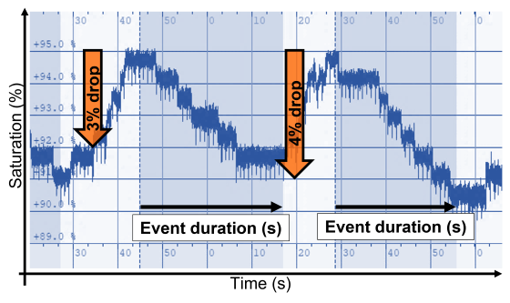
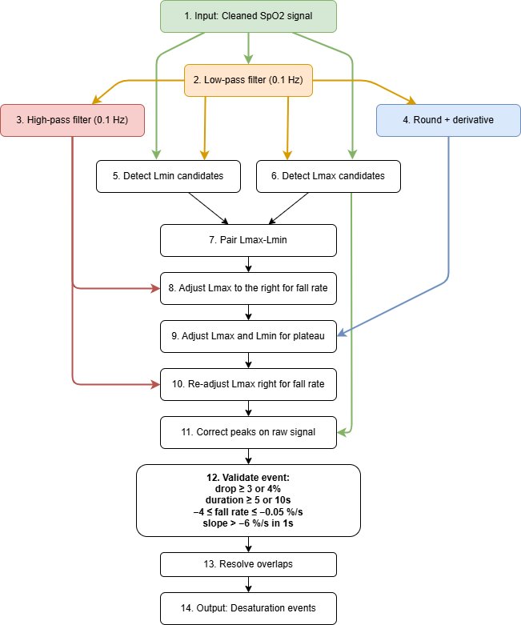

.. _Oxygen_saturation_report:

=========================
Report Oxygen Saturation
=========================

A tool to analyze oxygen saturation, detect oxygen desaturations, and export the :ref:`Oxygen_saturation_report_csv`.

Sleep staging is essential because oxygen saturation metrics are particularly relevant during the sleep period (SP).
The SP is defined as the duration (in minutes) from the first epoch scored as sleep (N1, N2, N3, or R) to the final awakening, including the last epoch scored as sleep.

The desaturation detector is inspired by ABOSA v1.2.2 [1], a freely available automatic oxygen saturation analysis software.
For more information on the desaturation detection algorithm implemented in Snooz, see :ref:`Oxygen_desaturation_detector`.

.. warning::

    The detector includes basic automatic artifact detection (limited to obvious artifacts). 
    Manual annotation of subtle artifacts is recommended prior to analysis. 
    The :ref:`Oximeter` viewer can be used to mark the invalid section. 

Steps
-----------------

| **Common settings** 
| Define the sleep cycles criteria for your study. 
| For more information, see :ref:`Sleep_Cycles_definition`.

**1 - Input Files**

Start by opening your PSG files (.edf, .sts or .eeg). 

- **European Data Format (EDF)** : 
  
  The corresponding .tsv file is required with .edf. Both files must be saved in the same directory and share the exact same filename.

- **Stellate format (up to version 6.2)** : 
  
  The corresponding .sig file is required with the .sts. Both files must be saved in the same directory and share the exact same filename.

- **NATUS format (version 9.1)** : 
  
  (*CEAMS users only*) The entire NATUS subject folder is required.

For more details on accepted formats, see :ref:`accepted_format`.

**2 - Invalid sections**

The user must select any annotations to be excluded from the oxygen saturation analysis. Invalid sections can be identified by the user using the :ref:`Oximeter` viewer.

**3 - Detection Settings**

The user must define the oxygen desaturation criteria, including:

- the oxygen drop threshold (3 % or 4%)
- the minimum desaturation duration (10 s or 5 s)
- the maximum desaturation duration (180 s or 20 s)

**4 - Output Files**

**Cohort Saturation Report**

The Oxygen Saturation Report for the cohort contains two main categories of metrics:

1. **Oxygen saturation variables** : minimum, maximum, and average oxygen saturation per recording, computed for:

- the full sleep period
- sleep halves and thirds
- individual sleep cycles
- sleep stages

2. **Oxygen desaturation variables** : including:

- oxygen desaturation index (ODI, events per sleep hour)
- severity (sum of areas under desaturation events, in percent·sec, over the sleep period)
- percentage of sleep time spent in desaturation
- average and median desaturation characteristics (duration, area, slope, drop)

All variables are computed for the total sleep period. 
Each recording is saved as one line in the cohort report, with new recordings appended to the existing file. 
The user specifies the file location to save the Cohort Oxygen Saturation Report.

**Optional outputs**

The detected desaturation events can be saved in the accessory file associated with the recording, for review.

The user can select an output directory to save the following outputs for each recording :

- A desaturation characteristics report, including:

   - start time (s)
   - duration (s)
   - slope (%/s)
   - depth (%)
   - area (%*s)

- The oxygen saturation graph, including invalid sections.

.. warning::

    For discontinuous recordings, the oxygen saturation graph is generated for each continuous recording session separately.

.. _Oxygen_desaturation_detector:

Desaturation events detector
------------------------------

The desaturation events are detected based on the following diagram, inspired by ABOSA [1]:

Diagram block descriptions
--------------------------

The following list summarizes each block shown in the desaturation detector diagram.
This format is intended for detailed descriptions.

#. **Input: Cleaned SpO2 signal**

   Start from a cleaned oxygen saturation signal after artifact rejection and invalid-section handling.  
   Artifact samples are identified as values outside the 50-100% range, NaN values, or rapid transitions detected from the squared high-pass filtered signal (threshold > 30). 
   For artifact detection, a Butterworth high-pass filter is applied with forward-backward filtfilt (zero phase): the nominal cutoff is 1 Hz, but it is adaptively limited for low sampling rates using cutoff_freq = min(1.0, fs_chan / 3.0) to keep the filter valid and stable. 
   Using an order-4 design with filtfilt gives an effective 8th-order response. Adjacent artifact samples are grouped and expanded by 1 s on each side. Short artifacts (<= 5 s) are linearly interpolated, unless the interpolation slope exceeds sqrt(30) (~5.5 %/s), in which case the segment is kept as artifact (NaN). Long artifacts (> 5 s) are replaced with NaN.

#. **Low-pass filter (0.1 Hz)**

   The raw SpO₂ signal is low-pass filtered at 0.1 Hz using a 2nd-order Butterworth filter applied forward-backward with `filtfilt` for zero-phase distortion,  
   resulting in an effective 4th-order response. This extracts the slow trend used to detect local minima and maxima.

#. **High-pass filter (0.1 Hz)**

   The low-pass filtered SpO₂ signal is high-pass filtered at 0.1 Hz using a 2nd-order Butterworth filter applied forward-backward with `filtfilt` for zero-phase distortion,  
   resulting in an effective 4th-order response. This emphasizes dynamic signal changes used to refine event onsets.

#. **Rounding and derivative**

   The low-pass filtered SpO₂ is rounded to whole percent values and its time derivative is computed (scaled by the sampling rate) to estimate per-second changes,  
   so that near-zero slopes correspond to plateaus.

#. **Detect Lmin candidates**

   Candidate local minima are identified on the low-pass filtered signal (minimum peak distance = 5 s, peak prominence = 1 %) as potential desaturation nadirs.  
   Each minimum's position is refined on the raw SpO₂ signal by searching for the minimum within a 5-second window centered on the low-pass minimum.

#. **Detect Lmax candidates**

   Candidate local maxima are identified on the low-pass filtered signal (minimum peak distance = 5 s, peak prominence = 1 %) as potential pre-desaturation baselines.  
   Each maximum's position is refined on the raw SpO₂ signal by searching for the maximum within a 5-second window centered on the low-pass maximum.

#. **Pair Lmax-Lmin**

   Local maxima without a corresponding local minimum are discarded. Each potential Lmax–Lmin pair cannot exceed 180 s in duration, and the minimum Lmax–Lmin drop must meet the user-defined threshold (3 % or 4 %).

#. **Adjust Lmax to the right for fall rate**

   The squared high-pass filtered SpO₂ signal is used to identify “activity” peaks. 
   Each candidate Lmax is iteratively advanced to successive activity peaks occurring before Lmin, 
   with shifts accepted only if the fall rate between the current Lmax and the candidate peak is greater than or equal to -0.05 %/s.

#. **Adjust Lmax and Lmin for plateau**

   The rounded low-pass SpO₂ trend and its derivative are used to identify plateaus between the currently adjusted Lmax and Lmin.
   A plateau is defined as a contiguous region between two “edges” where the rounded signal changes value (i.e., where the signal derivative is nonzero) and with a duration of at least 20 s.
   Event endpoints are adjusted to maximize desaturation depth: if the larger drop occurs before the plateau, Lmin is shifted to the start of the plateau; otherwise, Lmax is shifted to the end of the plateau.
   This procedure is iteratively repeated to accommodate multiple plateaus within the same candidate desaturation event.

#. **Re-adjust Lmax right for fall rate**

   The right-shift correction on Lmax is re-applied after plateau handling to ensure fall-rate constraints remain valid.

#. **Correct peaks on raw signal**

   Event boundaries are refined within a 5-second window on the raw SpO₂ signal for final measurement accuracy.

#. **Validate event**

   Events are retained only if they satisfy all of the following criteria:
   
   - Drop ≥ 3 % or 4 % (user-defined threshold)
   - Duration ≥ 5 s or 10 s
   - Average fall rate of the event between −4 %/s and −0.05 %/s
   - Fall rate in any 1-second sliding window is always greater than −6 %/s

#. **Resolve overlaps**

   Events overlapping with artifacts are excluded. Overlapping candidate events are resolved by keeping the event with the steepest fall rate.

#. **Output: Desaturation events**

   Final accepted desaturation events are exported for reporting. Each event includes the following variables:
   
   - group: text label "SpO2"
   - name: text label "desat_SpO2"
   - start_sec: event start time in seconds
   - duration_sec: event duration in seconds
   - channels: channels involved in the event (left empty)
   - slope: slope of the event (%/s)
   - depth: depth of the event (%)
   - area: area of the event (%·s)

Report
---------

.. toctree::
   Oxygen_saturation_report/Oxygen_saturation_report_csv

References
----------
1. Karhu, T., Leppänen, T., Töyräs, J., Oksenberg, A., Myllymaa, S., & Nikkonen, S. (2022). ABOSA – Freely available automatic blood oxygen saturation signal analysis software : Structure and validation. Computer Methods and Programs in Biomedicine, 226, 107120. https://doi.org/10.1016/j.cmpb.2022.107120\n

Version History
-----------------

* v2.1.0 : Distributed with CEAMS package version 7.2.0 — Snooz beta 2.0.1
    - Initial release of the tool.

* v2.6.0 : Distributed with CEAMS package version 7.3.0 — Snooz beta 3.0.0
    - The desaturation detector is now inspired by ABOSA [1].
    - The desaturation severity has been added to the report.
    - Automatic artifact detection has been adapted for low sampling rates (e.g., 1 Hz).
    - Improve path, filename, and extension handling for sleep cycle warning log file.
