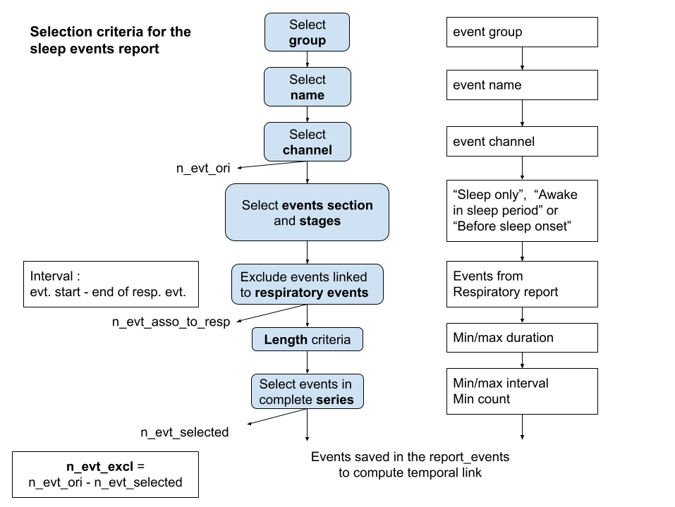

.. _event_report_info_csv:

===============================
Events Report Info
===============================

List of variables and their definitions
------------------------------------------

The list of the variables included in the events report. 

.. warning::

   If the variable definition is truncated, click on it and then use the right arrow key on your keyboard to view the full definition.

.. note::

   To download the original info.tsv file : `snooz_beta100_events_report_info.tsv <https://f004.backblazeb2.com/file/snooz-release/doc/snooz_beta100_events_report_info.tsv>`_

.. csv-table:: Events Report
   :header: "Variable Label", "Variable Definition"
   :file: snooz_beta100_events_report_info.tsv
   :delim: tab

The selection criteria
------------------------------------------

The criteria are applied to the list of events for inclusion in the "Events Report." The flowchart below illustrates the application of these criteria.

