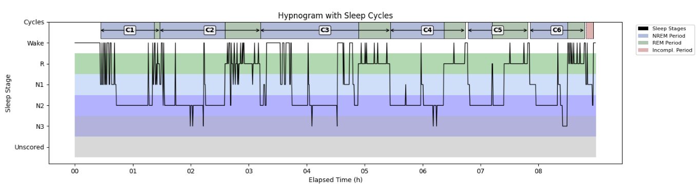

.. _Sleep_cycles_export:

===============================
Report Sleep cycles
===============================

This tool computes and report the sleep cycles. 

.. _Sleep_Cycles_definition:

Definition of Sleep Cycles
===============================
Sleep cycles typically last around 90 minutes to 2 hours, during which time the brain cycles from slow-wave sleep to REM sleep.  Sleep cycles are succession of NREM-REMs periods.  

Definition of NREM Period (NREMP)
-----------------------------------
* First NREMP : begins at the first NREM stage of the recording.
* Central NREMPs : begin at the next NREM stage following a REMP end.
* The NREMP ends at the start of a REMP.

REM Period (REMP)
-----------------------------------
* The REMP ends when there are 15 min without an R stage (except at the last cycle).
* The end is defined as the last R stage of the REMP or the beginning of the next NREMP.
* The REMP begins at the first stage R.

The hypnogram below shows six complete sleep cycles (NREMP + REMP) and one incomplete cycle at the end of the night.
The Y-axis indicates sleep stages, and the X-axis shows time from recording start (hours).
Cycles 1-6 are labeled above the hypnogram (e.g., C1-C6); the final incomplete cycle is unlabeled.
NREM periods appear in blue and REM periods in green.

Steps
===============================

**1 - Input Files**

Start by opening your PSG files (.edf, .sts or .eeg). 

- **European Data Format (EDF)** : 
  
  The corresponding .tsv file is required with .edf. Both files must be saved in the same directory and share the exact same filename.

- **Stellate format (up to version 6.2)** : 
  
  The corresponding .sig file is required with the .sts. Both files must be saved in the same directory and share the exact same filename.

- **NATUS format (version 9.1)** : 
  
  (*CEAMS users only*) The entire NATUS subject folder is required.

**2 - Cycle Definition**

Select or edit your sleep cycle criteria.

**3 - Output Files**

Sleep Cycle Cohort file : 

* The start and duration (s) of each NREM and REM period are saved in a .tsv (tab separated values) file defined by the user.
* The file includes 5 columns : group, name, start_sec, duration_sec and channels.
* Each row corresponds to a period and the group identifies the PSG recording.  
* New PSG recording are added in the .tsv file if it exists otherwise it is created.

Sleep Cycle specific to each PSG opened: 

* The hypnogram of each PSG is saved in a .png picture file
* The sleep stages and sleep periods events are saved in a .tsv file

Version History
-----------------

* v2.1.0 : Distributed with CEAMS package version 7.2.0 — Snooz beta 2.0.1
    - Initial release of the tool.

* v2.4.0 : Distributed with CEAMS package version 7.3.0 — Snooz beta 3.0.0 
    - Refactor hypnogram plotting to use contours instead of filled bars, and add background colors.
    - Fix Aeschebach method to support two REMPs without NREM between.
    - Improve path, filename, and extension handling for sleep cycle warning log file.

