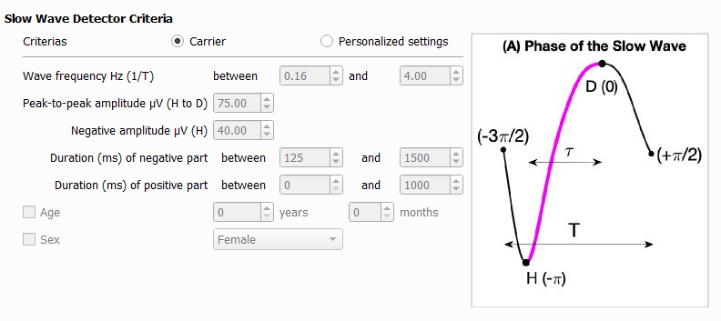

.. _Slow_wave_detection:

===============================
Slow Wave Detection
===============================

Description
-----------------

This tool detects slow waves, on specific sleep stages, with the algorithms inspired from (Bouchard et al. 2021) [1]

The detection criteria are editable, but below are the default ones, along with a schematic of a typical slow wave signal to help the user understand the slow wave characteristics included in the output report. 

The slow wave events detected are added into the accessory file (.tsv, .STS or .ent).

The event information is :

   * **group** : the group of the event.
   * **name** : the name of the event.
   * **start_sec** : the onset of the event in seconds (time elapsed from the lights off).
   * **duration_sec** : The duration of the event in seconds.
   * **channels** : The list of channels on which the events occurs.

Three additional output reports are available : 
   
   **1. Slow wave characteristics by event level**
      Files with the signal characteristic of each slow wave event. One file per recording, one row per event.

      The characteristics included are : 

         * peak-to-peak amplitude (µV) corresponds to H to D on the image (A)
         * duration (s) corresponds to T on the image (A)
         * frequency (Hz) corresponds to 1/T on the image (A)
         * negative peak amplitude (µV) correspond to H on the image (A)
         * negative duration (s) 
         * positive duration (s)
         * transition frequency (Hz) corresponds to 1/(2 tau) on the image (A)
         * slopes (µV/s)
            - from the 0 crossing to the min of the negative component
            - from the min of the negative component to the max of the positive component
            - from the max of the positive to the 0 crossing

   **2. Sleep stages**
      Files with the sleep stages selected for detection (useful to compute the slow wave density per division of the night). One file per recording, one row per sleep satge.

   **3. Slow wave characteristics averaged by subject level**
      A file with the slow wave characteristics averaged per subject.  One file for the cohort, one row per channel.

      The characteristics included are : 

      * slow wave count
      * the average slow wave characteristics listed above
         - total (all selected stages)
         - per sleep stage
         - per sleep cycle

      See :ref:`slow_wave_cohort_info_csv` for the variable definition. 
   
.. note::
   
   The Three outputs are needed for the slow wave classifier.

Steps
-----------------

**1 - Input Files**

   Start by opening your PSG files (.edf, .eeg or .sts).

   * The .tsv file is also needed for the EDF format.

   * The .sig file is also needed for Stellate format.

   * The whole NATUS subject folder is also needed for the .eeg format.

**2 - Non valid events**

   Select events to disable the slow wave detection.

   .. warning::
      
      Artefacts must be previously detected and saved in the accessory file.

**3 - Detection Criterias**

   Choose the criteria to detect slow wave and select the sleep stages you want to detect slow wave in.

**4 - Output Files**

   Select which reports to generate.

Report
---------------------------------------------------

.. toctree::
   Slow_Wave_detector/slow_wave_cohort_info_csv

References
-----------------
[1] Bouchard, M., Lina, J.-M., Gaudreault, P.-O., Lafrenière, A., Dubé, J., Gosselin, N., Carrier, J., 2021. Sleeping at the switch. Elife 10, e64337. https://doi.org/10.7554/eLife.64337 