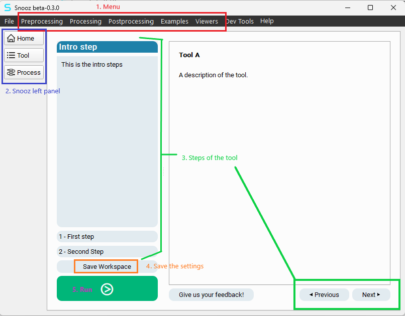
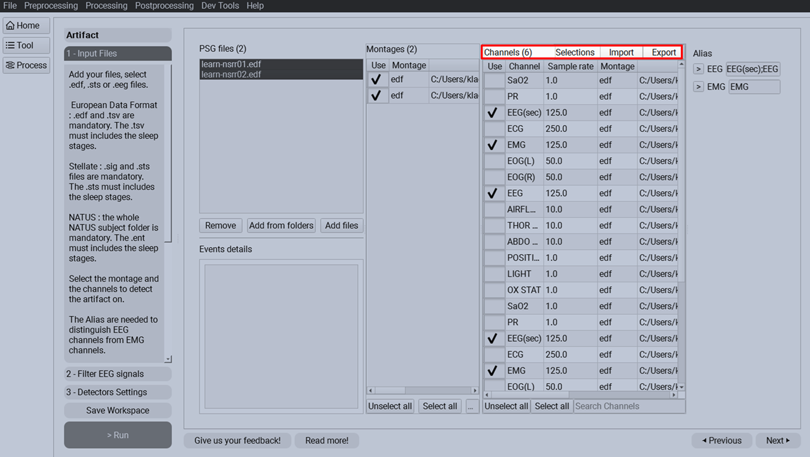

.. _tools:

======
Tools
======

This section describes how to use tools within Snooz.

Launch tools from the menu
=============================

The tools installed within Snooz are divided into three categories. Each category has direct access from the menu bar of Snooz.

1. **Preprocessing**: Includes importers/converters/extractors and the artifact detection tool.
2. **Processing**: Includes sleep stages analyses, event detectors, and power spectral analysis.
3. **Postprocessing**: Includes secondary analyses such as performance evaluation of detectors, transposition of cohort reports, and slow wave events analysis.

A new user
-----------

If you are new to Snooz, we recommend beginning with the Preprocessing category.  
The Preprocessing category includes importers, converters, extractors, and the artifact detection tool.
The main goal of the user is to create a cohort compatible with Snooz, see :ref:`accepted_format` for more details.

Ready for the analysis  
-----------------------

Once your PSG files are compatible with Snooz, proceed to the Processing category.  
The Processing category includes sleep analyses, event detectors, and power spectral analysis.

Cohort analysis  
----------------

The Postprocessing category includes secondary analyses, such as performance evaluation of detectors,
transposition of cohort reports, and slow wave events analysis.

Viewer
-------

The only available Viewer is the Oximeter, which allows you to select bad sections to generate a valid Oxygen Saturation Report.
The Oximeter is an application that operates within Snooz.  (See :ref:`apps` for more details.)

.. _accepted_format:

Polysomnography file format
==========================================================

The only accepted format for polysomnography is the European Data Format (EDF). For more details, see `European Data Format <https://www.edfplus.info/specs/edf.html>`_.
Snooz can also read signals from the EDF+ format; however, annotations must be imported from the EDF+ file into a .tsv (Tab-Separated Value) format compatible with Snooz.
See :ref:`EDF_Annotations_Importer` for more details.

.. note::

   **CEAMS users have access to two additional PSG file formats:**

   - **Harmonie (up to version 6.2)**: The signal recording file is a .SIG file, while the accessory file for sleep staging and annotations is a .STS file.
   - **NATUS (version 9.1)**: The entire recording folder is required. This folder typically includes files such as .eeg, .ent, .epo, among others.

Annotations file format
==========================================================

The columns of the annotations file are as follows:

1. **group** : The category of the annotation (annotations with different names can be grouped into the same category), e.g. artifact
2. **name**: The text label of the annotation, e.g., art_snooz
3. **start_sec**: The onset of the annotation in seconds, e.g., 300
4. **duration_sec** : The duration of the annotation in second, e.g., 30
5. **channels** : The list of channels on which the annotation occurs, e.g., ['LOC', 'ROC']
6. [Optional Column: **time elapsed (HH:MM:SS)**] : The time elapsed since the beginning of the recording, e.g., 00:05:00

.. note::
   - The **time elapsed (HH:MM:SS)** column is optional and intended solely for human readability; it is not processed by Snooz.  
   - If this column is omitted, all tools will function normally.  
   - When Snooz generates output .tsv files, the time elapsed column is automatically calculated from the start of the recording using the **start_sec** column.

To have an example of the Snooz annotations file see `Snooz_accessory_file.tsv <https://f004.backblazeb2.com/file/snooz-release/doc/Snooz_accessory_file.tsv>`_

The Snooz accessory .tsv file is human-readable and can be opened in any text editor or spreadsheet application (such as Excel). 
Items are separated by tabs, and decimal points are marked with a dot. 
The encoding format is UTF-8.

- **Item separator** : \t
- **Decimal separator** : .
- **Encoder format** : UTF-8

Many converters have been implemented in Snooz in order to create the Snooz accessory file for your cohort.
I recommend exploring the preprocessing category to see if your annotation files can be converted into Snooz accessory files.
The Snooz accessory file can be imported in the open-source universal viewer `EDFbrowser <https://www.teuniz.net/edfbrowser/>`_.
For more details, see :ref:`EDFbrowser_compatibility`.

Sleep staging
==========================================================

Sleep stages are represented by numbers in Snooz, as shown in the lookup table below:

.. list-table:: Sleep Stages Definition Table
   :widths: 30 30
   :header-rows: 1

   * - Description
     - name
   * - Awake
     - 0
   * - N1
     - 1
   * - N2
     - 2
   * - N3
     - 3
   * - REM
     - 5
   * - Unscored
     - 9

Sleep staging is included in the annotation file. Snooz expects sleep staging annotations to be grouped by **stage**, and the annotation name represents the corresponding stage.

.. csv-table:: The Snooz annotations for sleep stages
   :header: "group", "name", "start_sec", "duration_sec", "channels"
   :file: snooz_sleep_stages.tsv
   :delim: tab

.. warning::
   Users can rename their sleep stages according to this table using the "Edit Annotations" tool under the Preprocessing menu.  
   **S4 stages are not supported in Snooz**—please rename them as N3 for minimal compatibility.

.. note::
   To download a sample accessory file containing only sleep stages : `snooz_sleep_stages.tsv <https://f004.backblazeb2.com/file/snooz-release/doc/snooz_sleep_stages.tsv>`_

Navigate in the step-by-step interface
==========================================================

Here is an example of an empty tool to show you around.

**1.** Launch the tool from the menu bar of Snooz.  

**2.** The Snooz left panel allows you to navigate across views.  
   
   .. note::

      * Home : The Snooz Home page with the recents files list.
      * Tool : The step-by-step interface for the current tool.
      * Process : The pipeline with the interconnected modules.
  

**3.** The steps panel and the "Previous" and "Next" buttons allow you to navigate through each step of the tool.  

   .. note::

      * The introduction step is the home page of the tool. It describes how to use it. 
      * The number of steps is specific to each tool.
      * Each step describes what the user must define as settings.  

**4.** The user can save the workspace (.json file) at any moment. The workspace includes all the settings defined by the user in the current tool.   
   
**5.** Press the green push button to run the tool.  
   
   .. warning::  
      
      The user will be informed if a required setting for the run has not been defined by the user.

Load workspace
=============================

A workspace can correspond to a tool with some or all of its settings predefined for a specific analysis—including recordings and channel selections.

* To open a previously saved workspace, navigate to the menu **File** -> **Load Workspace**.

* In the file browser window, select the ``.json`` file and click Open.

.. warning::  
   
   The `.json` file includes the Snooz API version (e.g., ``"package_api_version": "2.0.0"``) as well as any package dependencies.  
   Make sure to use a workspace compatible with your installed version of Snooz.  
   If you're continuing an analysis started with an older version of Snooz, the workspace file may be obsolete.  
   As a workaround, simply import the recordings and the corresponding channel selection directly into the tool using the menu from the newly installed version of Snooz. See :ref:`import_file_selection`.

.. _import_file_selection:

Import recordings with corresponding channels
==================================================

Many tools offer the option to import recordings along with their corresponding channel selections, typically in Step ``1 - Input Files``.  
You must first export the file selection in order to be able to import it.

Export file selection
-----------------------

To use the import feature, you must first add your PSG files, select the montage and channels, and define any aliases if needed. 
Then, export the recordings along with their channel selections by clicking the **Export** button in Step ``1 - Input Files``, as shown in the figure below.

The user will be prompted to select an existing folder where the file selection will be exported. A confirmation message will indicate whether the export was successful.

Two files will be exported:

- **Snooz-Chan-log-{current date}.txt** : A text file logging the selected channels for each recording.
- **Snooz-Files-{current date}.txt** : A text file used by Snooz to import a predefined list of files along with their corresponding channels.

Tools Categories
=============================

.. toctree::
   :maxdepth: 2

   Preprocessing/Preprocessing
   Processing/Processing
   Postprocessing/Postprocessing