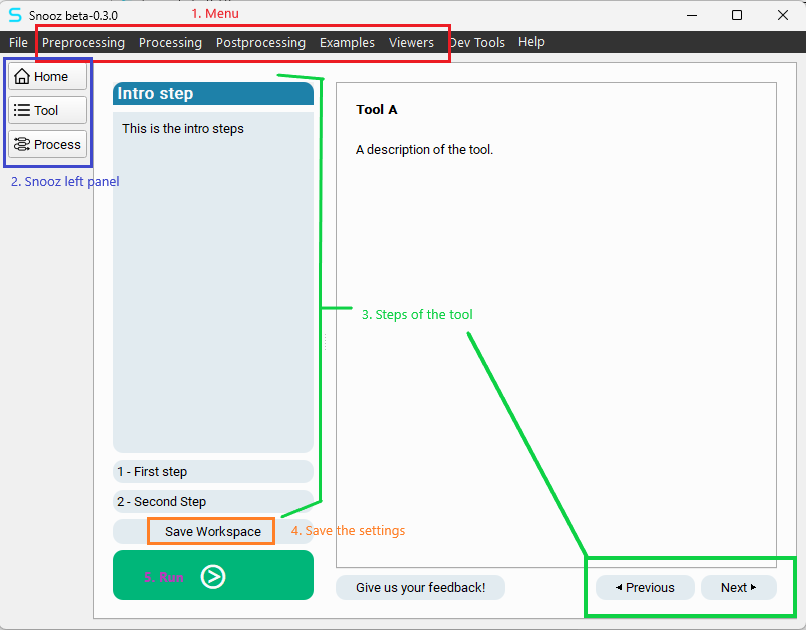
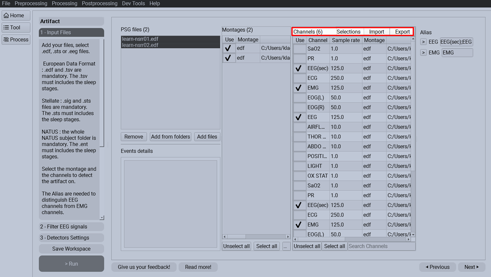

.. _tools:

==================
Tools and Apps
==================

This section describes how to use tools or apps available in Snooz.

Launch tools or apps from the menu
==========================================

The tools and apps installed in Snooz are organized into three categories, each accessible directly from the Snooz menu bar:

1. **Preprocessing**: Includes importers, converters, extractors, inspectors, and the artifact detector.
2. **Processing**: Includes sleep reports, event detectors, and EEG spectral power analysis.
3. **Postprocessing**: Includes secondary analyses such as performance evaluation of detected events, review of cohort reports, and tools for visualizing results.

A new user
-----------

If you are new to Snooz, we recommend beginning with the Preprocessing category.
This category includes importers, converters, extractors, inspectors, and the artifact detection tool.
The main goal at this stage is to prepare a cohort that is fully compatible with Snooz. See :ref:`accepted_format` for more details.

Ready for analysis
-----------------------

Once your PSG files are compatible with Snooz, proceed to the Processing category.
This category includes sleep reports, event detectors, and EEG spectral power analysis.

Cohort analysis  
----------------

The Postprocessing category includes secondary analyses, such as performance evaluation of detected events,
table transposition and review of cohort reports, and tools for visualizing the results.

Navigate the step-by-step tool interface
==========================================================

Below is an example of an empty tool to guide you through the interface.

**1.** Launch the tool from the menu bar of Snooz.  

**2.** The Snooz left panel allows you to navigate across views.  
   
   .. note::

      * Home : The Snooz Home page with the recents files list.
      * Tool : The step-by-step interface for the current tool.
      * Process : The pipeline with the interconnected modules.
  

**3.** The steps panel and the "Previous" and "Next" buttons allow you to navigate through each step of the tool.  

   .. note::

      * The introduction step is the home page of the tool. It describes how to use it. 
      * The number of steps is specific to each tool.
      * Each step describes what the user must define as settings.  

**4.** The user can save the workspace (.json file) at any moment. The workspace includes all the settings defined by the user in the current tool.   
   
**5.** Press the green push button to run the tool.  
   
   .. warning::  
      
      The user will be informed if a required setting for the run has not been defined by the user.

Load a Workspace for a Specific Tool
=======================================

A workspace can correspond to a tool with some or all of its settings predefined for a specific analysis—including recordings and channel selections.

* To open a previously saved workspace, navigate to the menu **File** -> **Load Workspace**.

* In the file browser window, select the ``.json`` file and click Open.

.. warning::  
   
   The `.json` file includes the Snooz API version (e.g., ``"package_api_version": "2.0.0"``) as well as any package dependencies.  
   Make sure to use a workspace compatible with your installed version of Snooz.  
   If you're continuing an analysis started with an older version of Snooz, the workspace file may be obsolete.  
   As a workaround, simply import the recordings and the corresponding channel selection directly into the tool using the menu from the newly installed version of Snooz. See :ref:`import_file_selection`.

.. _import_file_selection:

Import recordings with corresponding channels
==================================================

Many tools offer the option to import recordings along with their corresponding channel selections, typically in Step ``1 - Input Files``.  
You must first export the file selection in order to be able to import it.

Export file selection
-----------------------

To use the import feature, you must first add your PSG files, select the montage and channels, and define any aliases if needed. 
Then, export the recordings along with their channel selections by clicking the **Export** button in Step ``1 - Input Files``, as shown in the figure below.

The user will be prompted to select an existing folder where the file selection will be exported. A confirmation message will indicate whether the export was successful.

Two files will be exported:

- **Snooz-Chan-log-{current date}.txt** : A text file logging the selected channels for each recording.
- **Snooz-Files-{current date}.txt** : A text file used by Snooz to import a predefined list of files along with their corresponding channels.

Tool and App Categories
=============================

.. toctree::
   :maxdepth: 2

   Preprocessing/Preprocessing
   Processing/Processing
   Postprocessing/Postprocessing